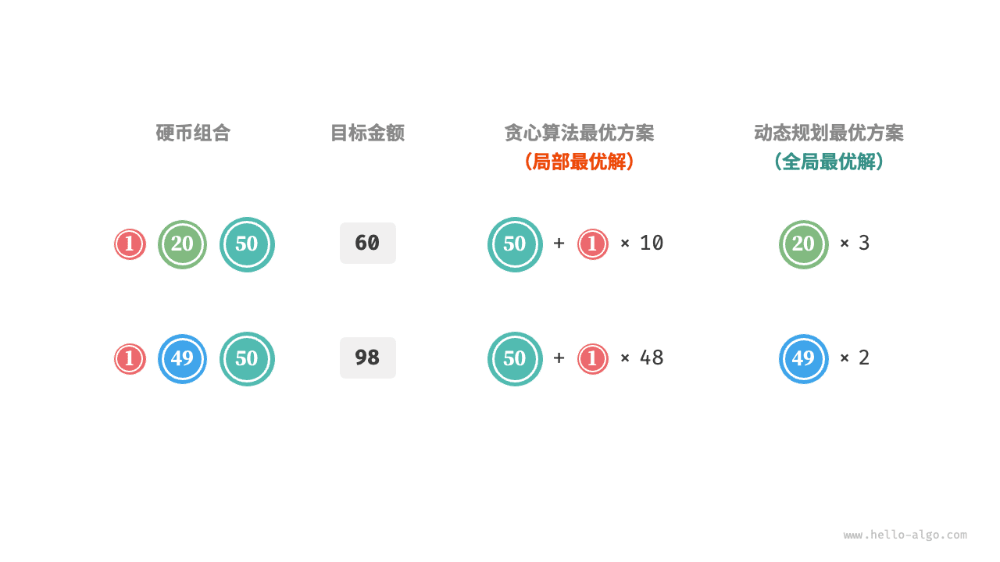

# 贪心算法｜贪心算法的优点与局限性

> 来源：[krahets 与《Hello 算法》开源贡献者](https://www.hello-algo.com/chapter_greedy/greedy_algorithm/)  
> 许可：[CC BY-NC-SA 4.0](https://creativecommons.org/licenses/by-nc-sa/4.0/)  
> 语言：原生简体中文  
> 版本：69932aed1891a7b7f6a0de88cd116d3fe13e7032  
> 署名：原作《Hello 算法》，作者 krahets 及开源贡献者。  
> 使用限制：仅限实验室内部、个人学习与其他非商业用途；改编内容须保持相同许可。

## 贪心算法的优点与局限性

**贪心算法不仅操作直接、实现简单，而且通常效率也很高**。在以上代码中，记硬币最小面值为 $\min(coins)$ ，则贪心选择最多循环 $amt / \min(coins)$ 次，时间复杂度为 $O(amt / \min(coins))$ 。这比动态规划解法的时间复杂度 $O(n \times amt)$ 小了一个数量级。

然而，**对于某些硬币面值组合，贪心算法并不能找到最优解**。下图给出了两个示例。

- **正例 $coins = [1, 5, 10, 20, 50, 100]$**：在该硬币组合下，给定任意 $amt$ ，贪心算法都可以找到最优解。
- **反例 $coins = [1, 20, 50]$**：假设 $amt = 60$ ，贪心算法只能找到 $50 + 1 \times 10$ 的兑换组合，共计 $11$ 枚硬币，但动态规划可以找到最优解 $20 + 20 + 20$ ，仅需 $3$ 枚硬币。
- **反例 $coins = [1, 49, 50]$**：假设 $amt = 98$ ，贪心算法只能找到 $50 + 1 \times 48$ 的兑换组合，共计 $49$ 枚硬币，但动态规划可以找到最优解 $49 + 49$ ，仅需 $2$ 枚硬币。

也就是说，对于零钱兑换问题，贪心算法无法保证找到全局最优解，并且有可能找到非常差的解。它更适合用动态规划解决。

一般情况下，贪心算法的适用情况分以下两种。

1. **可以保证找到最优解**：贪心算法在这种情况下往往是最优选择，因为它往往比回溯、动态规划更高效。
2. **可以找到近似最优解**：贪心算法在这种情况下也是可用的。对于很多复杂问题来说，寻找全局最优解非常困难，能以较高效率找到次优解也是非常不错的。
