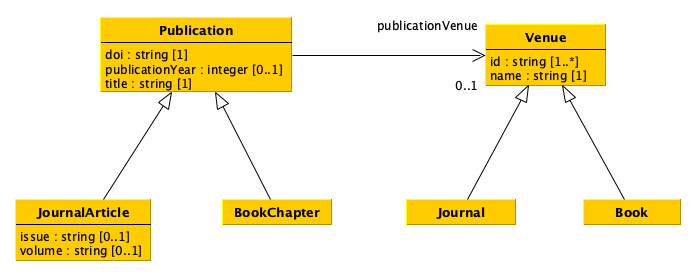
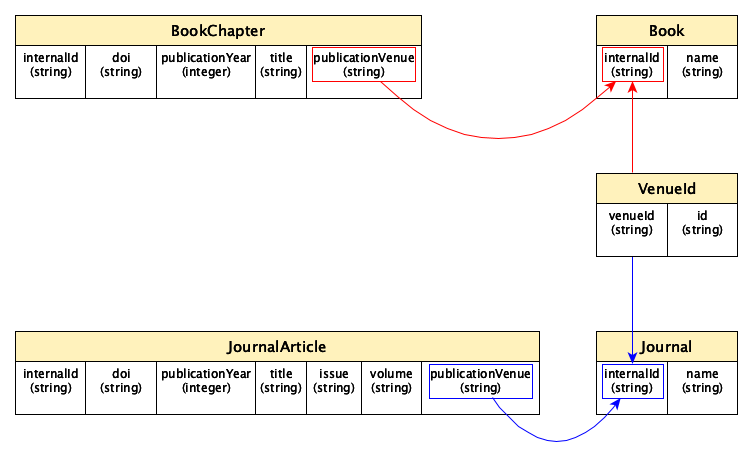

# Configuring and populating a relational database

> 来源：[博洛尼亚大学 Digital Humanities and Digital Knowledge 课程团队](https://thinkcompute.github.io/19-relational-database.html)  
> 许可：[CC BY 4.0](https://creativecommons.org/licenses/by/4.0/)  
> 语言：英文补充资料  
> 版本：0c6a477bcdb50fd73b3b06d08a8f56324c86454f  
> 署名：改编自 Silvio Peroni、Ivan Heibi、Arcangelo Massari（2025）《Think and Compute: a Primer for Digital Humanists》，原作采用 CC BY 4.0。

# Configuring and populating a relational database

In this chapter we introduce how to use [SQLite](https://en.wikipedia.org/wiki/SQLite) in Python.

## SQLite

[SQLite](https://www.sqlite.org) is a relational database management system (RDBMS) which can be embedded into the end program and does not follow a classic client–server architecture, where the server database is independent and is actually accessed by client programs.

Python includes [SQLite within its standard library](https://docs.python.org/3/library/sqlite3.html) - it means that you can create and modify SQLite database directly from Python code. This simplifies a lot the first approach to DBMS, as we will see in the following sections. In addition, there are already several [documents on how to use SQLite in Python](https://www.digitalocean.com/community/tutorials/how-to-use-the-sqlite3-module-in-python-3) that are worth of reading to get more details about the features it provides. In this tutorial, we will see the main constructs used to create a database and populate it with tables.

## Create a new database

First of all, we have to import functions defined in the [`sqlite3` package](https://docs.python.org/3/library/sqlite3.html) in order to use its classes to create and execute operations on a database. The first thing we need, in particular, is to use the [class `Connection`](https://docs.python.org/3/library/sqlite3.html#sqlite3.Connection). This class is responsible to connect to a particular database defined as a file. In SQLite, any database is actually stored in one single `.db` file. A new object having class `Connection` is created by calling the [function `connect`](https://docs.python.org/3/library/sqlite3.html#sqlite3.connect), as shown as follows:

```python
from sqlite3 import connect

with connect("notebook/05-publications.db") as con:
    # do some operation with the new connection
    
    con.commit()  # commit the current transaction to the database
    
    # when you finish, the collection will be closed automatically via 'with'
```

As you can see, the way we use a new connection to a database is similar to what we have seen with files in previous tutorials, using the instruction `with` that allows us to close the connection to the database when all the operations with it have been executed. Before closing the connection, though, it is crucial to run the [method `commit`](https://docs.python.org/3/library/sqlite3.html#sqlite3.Connection.commit) in order to commit the current [transaction](https://en.wikipedia.org/wiki/Database_transaction) (i.e. the set of operations that may have changed the status of a database) to the database itself. Of course, it is possible to call the method `commit` more than once during the lifespan of a connection. In practice, you can call it every time you execute an operation that modifies the status of the database, in order to record such modification into the file system.

It is worth mentioning that the `.db` file specifed as input of the function `connect` is created if no database is available with that name in the path specified. However, if such a file already exists, it will be loaded by the connection with the information it already stores.

## From a diagram to tables

Before starting populating the database, it is necessary to create the appropriate tables that enable the description of all the entities (and related data) we need. In order to understand what to do, it is important to look at the UML diagram describing the data model introduced in a previous tutorial.



There are different strategies that we can follow to crete the tables describing a data model such as that described above. For instance, we can approach such a translation as follows:

* Create a table for each class which does not have any subclass (i.e. the most concrete classes), by using as columns all single-valued attributes and relations defined in such a class and all its superclasses. Concretely, we create four tables, i.e. for `JournalArticle` and `BookChapter` (which inherit all the attributes and relations of `Publication`), and `Journal` and `Book` (which inherit all the attributes and relations of `Venue`).

* For each of the tables above, add also a new column that enables us to specify an internal identifier we use to clearly identify all the entities of the various types. In this case, it is enough to add an additional column in each table, e.g. `internalId`. Suggestion: having an internal identifier which is globally unique in the database is the way to go.

* Keep in mind that the value of all the columns related to relations must point to an internal identifier defined in some of the tables. For instance, the column `publicationVenue` in the table `JournalArticle` will contain an internal identifier of a journal as defined in the column `internalId` of the table `Journal`.

* Create a two column table, where the first column enables the identification of an internal identifier of an entity specified in the other tables, for each multivalued attribute or relation in the diagram. In the example, only the attribute `id` of the class `Venue` is multivalued, and thus an additional table `VenueId` is created to link a `Venue` entity with one or more identifiers characterising it.

A possible translation of the UML diagram above following the rules just mentioned is shown as follows:



It is worth mentioning that this is not the only possible way to translate the original UML data mode, and other paths can be followed to this respect.

## How to create and populate a table with Pandas

Pandas makes available specific methods that simplify the creation and population of database tables via `DataFrame`, and that take care also of running some database-related operations such as the `commit` shown above. The main tool to use to push a table into a SQLite database is the [method `to_sql`](https://pandas.pydata.org/docs/reference/api/pandas.DataFrame.to_sql.html) of the class `DataFrame`. However, before seen how to use it to populate a database, let us reorganise the original data provided in CSV about publications and venues in a series of Pandas data frames recalling the tabular structures introduced in the previous section.

### Venue-Id table

Let us start by creating the `VenueId` table. This can be done using one of the columns of the [CSV document describing venues]("01-venues.csv"), i.e. the column `id`. Thus, we create a new sub-data frame containing only that column and we add an additional column defining the strings referring to the internal identifiers of each venue. The following code shows how to perform all these operations:

```python
from pandas import read_csv, Series

venues = read_csv("notebook/01-venues.csv", 
                  keep_default_na=False,
                  dtype={
                      "id": "string",
                      "name": "string",
                      "type": "string"
                  })

# This will create a new data frame starting from 'venues' one,
# and it will include only the column "id"
venues_ids = venues[["id"]]

# Generate a list of internal identifiers for the venues
venue_internal_id = []
for idx, row in venues_ids.iterrows():
    venue_internal_id.append("venue-" + str(idx))

# Add the list of venues internal identifiers as a new column
# of the data frame via the class 'Series'
venues_ids.insert(0, "venueId", Series(venue_internal_id, dtype="string"))

# Show the new data frame on screen
venues_ids
```

In practice, after reading the CSV, we create a new data frame with only the column `id` by using the command `<data frame>[[<column name 1>, <column name 2>, ...]]`. In practice, this command will create a new sub-data frame using only the values in the columns specified.

Then, we have to define the internal identifiers for all the venues. To this end, we iterate over the rows of the new data frame and we compose a list of internal identifiers by concatenating the string `"venue-"` with the string of the values specified in the index of each row. Thus, we add that list (mediated via a `Series` of string values) into the data frame using the [method `insert`](https://pandas.pydata.org/docs/reference/api/pandas.DataFrame.insert.html), which takes in input the position where to put the new column (`0` is the first position, `1` is the second position, etc.), the column name, and the values to associate to that column.

### Tables for journals and books

With this new table, we can start to create the two additional tables for journals and books. First of all, we create two new data frames containing only entities (i.e. rows) of the same type (e.g. journals) by using the method `query`:

```python
# Data frame of journals
journals = venues.query("type == 'journal'")
journals  # Showing the data frame
```

Then, for each row in the new data frame, we retrieve the associated `internalId` of each journal by looking at the table `venueId` created above. In this case, we can use the method `merge` to accomplish the task:

```python
from pandas import merge

df_joined = merge(journals, venues_ids, left_on="id", right_on="id")
df_joined
```

Finally, the final journal table can be defined by selecting only two columns of the last merged data frame and by modifying the column name `venueId` in `internalId`, as shown as follows:

```python
journals = df_joined[["venueId", "name"]]
journals = journals.rename(columns={"venueId": "internalId"})
journals
```

The rename of a column is performed with the [method `rename`](https://pandas.pydata.org/pandas-docs/stable/reference/api/pandas.DataFrame.rename.html), that takes in input a dictonary with the named paramenter `columns`, where each key represent the old column name while the value is the new column name. The method returns a new data frame where the columns are renamed as specified.

A similar organisation can be provided also for books, by using the code specified above, customising it for handling books:

```python
# Data frame of books

books = venues.query("type == 'book'")
df_joined = merge(books, venues_ids, left_on="id", right_on="id")
books = df_joined[["venueId", "name"]]
books = books.rename(columns={"venueId": "internalId"})
books
```

### Tables for publications

Similarly, all the other tables (i.e. `JournalArticles` and `BookChapters`) can be created using the same set of operations, but starting from the [CSV document containing publications]("notebook/01-publications.csv"). First, we create a new column with all the internal identifiers for all publications, as shown as follows:

```python
publications = read_csv("notebook/01-publications.csv", 
                        keep_default_na=False,
                        dtype={
                            "doi": "string",
                            "title": "string",
                            "publication year": "int",
                            "publication venue": "string",
                            "type": "string",
                            "issue": "string",
                            "volume": "string"
                        })

# Create a new column with internal identifiers for each publication
publication_internal_id = []
for idx, row in publications.iterrows():
    publication_internal_id.append("publication-" + str(idx))
publications.insert(0, "internalId", Series(publication_internal_id, dtype="string"))

publications
```

Then, we create the table for journal articles similarly to what we have done before:

```python
# Data frame of journal articles
journal_articles = publications.query("type == 'journal article'")

df_joined = merge(journal_articles, venues_ids, left_on="publication venue", right_on="id")
journal_articles = df_joined[
    ["internalId", "doi", "publication year", "title", "issue", "volume", "venueId"]]
journal_articles = journal_articles.rename(columns={
    "publication year": "publicationYear",
    "venueId": "publicationVenue"})
journal_articles
```

Similarly, we create the table for book chapters:

```python
# Data frame of book chapters
book_chapters = publications.query("type == 'book chapter'")
df_joined = merge(book_chapters, venues_ids, left_on="publication venue", right_on="id")
book_chapters = df_joined[
    ["internalId", "doi", "publication year", "title", "venueId"]]
book_chapters = book_chapters.rename(columns={
    "publication year": "publicationYear",
    "venueId": "publicationVenue"})
book_chapters
```

### Adding the tables to the database

As anticipated before, adding a table to a database is done, in Pandas, using the `DataFrame` method `to_sql`. This method takes in input two mandatory parameters (identifying the name of the table in the database and the database connection) plus a series of optional named parameters, among which the parameter `if_exists` that, when set to `"replace"`, replaces the values in an existing database table having the same name with the new data, and the parameter `index` that, when set to `False`, does not add the data frame index in the database. Thus, adding the five tables to the SQLite database created at the very beginning can be done running the following commands:

```python
with connect("notebook/05-publications.db") as con:
    venues_ids.to_sql("VenueId", con, if_exists="replace", index=False)
    journals.to_sql("Journal", con, if_exists="replace", index=False)
    books.to_sql("Book", con, if_exists="replace", index=False)
    journal_articles.to_sql("JournalArticle", con, if_exists="replace", index=False)
    book_chapters.to_sql("BookChapter", con, if_exists="replace", index=False)
```
