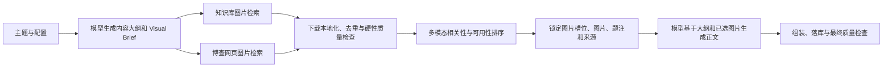

# 教师端可信 Agent 与多模态资源生成设计 SPEC

> 日期：2026-08-09  
> 状态：已实施，自动化与本机真实端到端验收完成（PPT 按范围后置）
> 适用范围：教师端“问答与生成”、课程知识库、课程资源  
> 配套计划：`docs/superpowers/plans/2026-08-09-grounded-agent-and-multimodal-resource-generation.md`  
> 配套验收：`docs/acceptance/2026-08-09-grounded-agent-and-multimodal-resource-generation.md`

## 1. 背景与问题结论

前端的大部分布局问题已经处理，当前剩余风险集中在“功能是否真的完成”，而不是页面是否看起来完整。现场日志表明：教师已在左侧勾选知识文档并开启 RAG，但 Agent 计划先“生成回答”，后“检索资料”，执行器第一步又允许直接回答，最终只调用 `create_plan`，没有调用 `rag_search`。这不是模型聪明程度问题，而是编排层没有把用户选择转化为不可绕过的执行约束。

资源生成也存在同类问题：页面有配置项和按钮，不代表配置真实传到后端、知识来源被正确使用、任务成功落库、资源可预览。报告等资源的图片目前主要是生成正文后的补插，缺少“为什么需要图、放在哪里、图片是否合格、图片如何影响正文”的完整链路。

因此本阶段不追求高度自治 Agent，目标是建立一个简单但可靠的教师工作台：用户选择什么来源、开启什么能力、创建什么资源，系统就真实地按约定调用对应工具，并留下可验证的结果。

## 2. 目标

1. 修复 Agent 基础编排：RAG、Web 和资源生成工具必须按用户意图可靠调用，不能被模型计划绕过。
2. 统一问答与资源生成的知识来源语义：选中文档、全课程检索、不使用知识库三种模式明确且一致。
3. 重做八类非 PPT 资源配置：字段少、必填项清楚、所有字段真实生效。
4. 建立通用图文生成链路：先规划图片需求，再检索、筛选并把真实图片交给模型生成正文。
5. 补齐思维导图的生成、落库、预览、基础编辑和导出。
6. 为已生成资源提供简洁的编辑、保存和真实可用的导出能力。
7. 对问答工具编排和八类资源执行端到端验证，并形成可复验的验收记录。

## 3. 本阶段不做

- PPT 新实现后置。现有入口只做不破坏性维护，不投入图文、配置或端到端扩展；后续单独评估 `ppt-master` 的许可证、架构和集成成本。
- 学生端后置。本阶段不新增学生页面、学生权限模型或师生协作流程。
- 不追求复杂 Agent 自主规划、长期记忆、自我反思、多 Agent 协商。
- 不做多人协同编辑、版本对比、复杂富文本排版系统。
- 不承诺 DOCX/PDF 等当前没有可靠实现的导出格式；页面不得展示不可工作的按钮。

## 4. 核心设计原则

### 4.1 用户选择高于模型计划

RAG、Web、来源范围和资源类型属于确定性执行约束，不交给语言模型猜测。模型可以规划内容，但不能取消用户明确开启的工具，也不能在必需检索完成前输出最终答案。

### 4.2 证据先于回答

只要本轮要求 RAG 或 Web，回答必须等待对应工具完成。检索失败或没有证据时，系统明确说明失败或证据不足，不静默退化为模型记忆回答。

### 4.3 图片先规划、后写正文

图文资源采用“内容大纲 + 图片需求 → 图片候选 → 合格图片 → 带图正文”的顺序。图片不是正文生成后的随机装饰，而是内容结构的一部分。

### 4.4 配置少而有效

每类资源首屏只保留一个核心必填项和少量高频选项。低频项放入“更多设置”。后端不读取的字段必须删除或补齐读取逻辑。

### 4.5 自动化可重复，真实服务可冒烟

持续回归使用固定数据和可控替身，保证确定性；同时保留带真实 RAG、博查和模型配置的冒烟脚本，用于部署环境验收。两类验证不可互相替代。

## 5. 统一知识来源契约

### 5.1 来源模式

统一使用以下三种模式：

| 模式 | UI 文案 | 语义 |
|---|---|---|
| `selected_documents` | 按已选文档生成/回答 | 只允许在左侧已勾选文档中检索 |
| `course_auto` | 使用课程全部资料 | 根据用户主题在全部可用课程资料中检索相关内容；不是把所有原文塞入提示词 |
| `none` | 不使用知识库 | 不调用课程 RAG，不携带文档 ID |

打开资源生成配置时：

- 左侧存在可用的已选文档：默认 `selected_documents`，自动带入这些文档。
- 左侧没有选中文档：默认 `none`。
- 用户可以显式切换为 `course_auto`。
- 已选文档在弹窗打开后发生变化时，本次弹窗保持快照，避免用户配置过程中来源悄然改变；重新打开时重新同步。

问答区也采用相同来源计算规则。RAG 开关关闭时为 `none`；开启且有选中文档时为 `selected_documents`；开启但没有选中文档时为 `course_auto`。前端请求和执行轨迹必须保存最终模式。

### 5.2 来源解析

- `selected_documents`：校验文档是当前课程文档，或是当前教师拥有的个人知识库文档，且状态为 `ready`；检索过滤条件必须只包含已解析的安全索引键。个人文档不得被其他用户通过公开 ID 或路径引用。
- `course_auto`：在当前课程所有 `ready` 文档中按问题检索，禁止一次性读取并拼接全部文档正文。
- `none`：不构建知识库上下文。
- 直接生成端点和预检端点执行相同的课程生成权限与来源校验，不能依赖前端先调用预检。

## 6. P0 Agent 可靠编排

### 6.1 确定性检索指令

在调用规划模型之前，根据请求生成 `RetrievalDirective`：

```text
rag_required: bool
rag_scope: none | selected_documents | course_auto
selected_document_ids: string[]
web_required: bool
query: string
```

该指令进入运行时状态，并贯穿规划、执行、工具结果和最终回答门禁。

### 6.2 计划规范化

规划器输出后执行确定性规范化：

1. 若要求 RAG/Web，合并或创建唯一的“检索资料”步骤。
2. 把检索步骤移动到任何“回答、总结、生成正文、生成资源”步骤之前。
3. RAG 与 Web 可在同一检索步骤并行执行。
4. UI 展示规范化后的真实计划，不展示模型原始但不会执行的错误顺序。

### 6.3 执行器门禁

执行器不能只看当前计划步骤的 `expected_tools`。只要 `RetrievalDirective` 要求某工具且当前轨迹未成功执行，就先发起工具调用。

允许输出最终回答的条件：

```text
所有 required tools 均 completed
AND 每个 required retrieval 至少返回一条可用证据
```

若工具报错、超时或零证据，返回结构化的“检索未完成/未找到证据”，保留重试入口，不生成伪装成已检索的知识性答案。

### 6.4 基础工具验收范围

- 仅 RAG：先 `rag_search`，再回答，回答带知识库来源。
- 仅 Web：先 `web_search`，再回答，回答带网页来源。
- RAG + Web：两个工具均完成后回答，来源可区分。
- 无工具：允许直接回答。
- 资源生成意图：调用正确资源工具或直接生成端点，形成后台任务与落库资源。
- 计划 UI：工具名称、完成状态与后台实际轨迹一致。

## 7. 通用图文生成链路

### 7.1 流程



### 7.2 Visual Brief

每个需要图片的位置形成稳定槽位：

```json
{
  "slot_id": "section-2-concept-diagram",
  "section_id": "section-2",
  "purpose": "解释链表节点和 next 指针关系",
  "query": "linked list node next pointer diagram",
  "preferred_kind": "diagram",
  "required": false,
  "caption_hint": "链表节点连接关系",
  "source_preference": ["knowledge_base", "web"]
}
```

正文生成时传入已选图片的本地引用、简短视觉描述、题注、来源和许可证提示。模型只能引用已锁定的 `slot_id`，组装器负责真实插图，避免模型伪造 URL。

### 7.3 图片候选与质量门槛

候选统一为 `VisualCandidate`，至少记录：来源类型、原始 URL/知识文档 ID、本地文件、MIME、尺寸、文件哈希、检索词、来源页面、题注、许可证提示和评分。

硬性过滤：

- 下载成功且 MIME 为受支持图片；
- 最短边和像素总量达到资源策略阈值；
- 非占位图、非追踪像素、非明显损坏文件；
- 内容哈希和感知哈希去重；
- URL 与本地路径均经过安全校验。

软性排序考虑：与槽位目的的视觉相关性、可读性、来源可信度、版权信息完整度、与同一资源中其他图片的差异度。没有合格图片时允许该槽位为空，并记录原因；不使用低质量图凑数。

### 7.4 资源接入策略

- 第一批强制接入：教学报告、教学博客、教案、AI 课堂。
- 可选图片策略：闪卡、习题、课堂小游戏、思维导图节点可按内容需要请求图片，但不把图片作为成功条件。
- PPT 本阶段不接入。
- 文生图只作为未来可选兜底，且不得用于需要事实准确性的照片、图表或史料。

## 8. 八类资源的简洁配置

所有表单统一为“核心设置 + 更多设置 + 资料范围”。必填项显示“必填”，可选项不以错误阻塞默认生成。

| 资源 | 核心必填 | 首屏高频项 | 更多设置 | 真实输出 |
|---|---|---|---|---|
| 教学报告 | 主题 | 模板、深度 | 适用对象、结构重点、补充要求 | Markdown 报告、引用、可选图片 |
| 教案 | 教学主题 | 适用对象、课时 | 教学目标、课型、教学流程、补充要求 | 结构化教案 + Markdown 预览 |
| 教学博客 | 主题 | 读者、语气、篇幅 | 文章结构、补充要求 | Markdown 博客、引用、可选图片 |
| 习题 | 主题 | 题量、难度、题型 | 答案、解析、适用对象 | 结构化题目与答案 |
| 闪卡 | 主题/标题 | 数量、难度 | 分类、显示来源 | 结构化正反面卡片 |
| 思维导图 | 主题 | 层级深度 | 关系侧重点 | 结构化树、可视化预览 |
| 课堂小游戏 | 主题 | 模板、卡片数 | 难度、预计用时 | 可运行 HTML + 结构化题目 |
| AI 课堂 | 主题 | 适用对象、时长 | 教学目标、场景数、教学方式、语音、补充要求 | 可播放场景资源 |

每个序列化字段必须在对应 Pydantic 请求模型和任务处理器中有读取点，并通过契约测试证明。无读取点的字段要么实现，要么从界面删除。

## 9. 思维导图完成定义

1. 输入主题和来源，提交 `graph` 后台任务。
2. 输出统一树结构：`id`、`label`、`description?`、`relation?`、`children[]`。
3. 生成结果按 `mind_map` 作为用户可理解的资源类型展示，后端兼容历史 `graph` 别名。
4. 资源中心能够预览、缩放、适配画布、折叠分支。
5. 支持改名、修改节点文字、增加/删除普通节点并保存；禁止删除根节点。
6. 支持 JSON 导出；PNG 仅在现有画布能够稳定导出且有自动化验证时开放。
7. 失败任务可见错误原因并可用原配置重试。

## 10. 已生成资源的简洁编辑与导出

- 报告、博客、教案：Markdown 编辑 + 预览，保存时校验课程权限并更新 `updated_at`。
- 习题、闪卡：表格式/卡片式结构编辑，保存前做最小字段校验。
- 思维导图：节点文字和树结构的轻量编辑。
- 游戏：允许编辑题目数据后重新组装已有模板，不开放任意 HTML 编辑。
- AI 课堂：沿用场景级数据结构，只开放标题、旁白和场景正文等安全字段。
- 所有资源保留现有改名、删除、发布、撤回能力。
- 导出只显示真实可用格式：文本资源 Markdown，结构化资源 JSON，游戏 HTML，AI 课堂沿用已存在的视频/资源导出。
- 保存接口必须校验教师对课程的编辑权限，并防止跨课程资源修改。

## 11. 观测与失败语义

每次问答记录 `source_mode`、选中文档 ID、required tools、实际工具调用、证据数量、最终门禁结果和总耗时。每次资源生成记录配置快照、来源快照、图片槽位与候选统计、任务 ID、落库资源 ID和失败阶段。

用户可见错误使用清晰语义：资料不可用、检索失败、未找到证据、网页搜索不可用、图片未找到、生成失败、保存失败。日志保留技术错误码，不向前端泄露密钥、内部绝对路径或完整第三方响应。

## 12. 安全、隐私与版权

- 所有直接生成和资源写接口服务端校验当前用户与课程权限。
- 选中文档 ID 必须属于当前课程，禁止依赖前端过滤。
- 网页图片下载限制协议、响应体积、重定向次数、MIME 和内网地址，防止 SSRF。
- 外部图片保存来源页面和版权提示；来源不明确时在资源中标注“请在发布前核验版权”。
- 模型与搜索服务密钥只从服务端配置读取，不进入任务快照或前端。

## 13. 决策记录

| 编号 | 决策 | 依据与影响 |
|---|---|---|
| D-001 | 在当前 `main` 工作区继续实施 | 用户明确要求直接执行；现有未提交知识库改动是本次依赖。实施时只增量修改，不重置用户改动。 |
| D-002 | 无左侧选择时默认 `none`，不默认 `course_auto` | 与用户明确语义一致，避免不知情地使用课程资料。 |
| D-003 | 强制检索失败时 fail closed | 可靠性优先于“总能回答”，避免界面声称使用资料而实际凭模型记忆作答。 |
| D-004 | 图片不足时留空槽位 | 低质量或不相关图片比少图更损害教学资源。 |
| D-005 | 编辑采用现有资源结构上的轻量编辑 | 满足必要可用性，避免本阶段演变为复杂内容管理系统。 |
| D-006 | 自动化 E2E 使用可控服务，真实供应商使用独立冒烟 | 既保证回归稳定，也验证真实 RAG、博查和模型链路。 |
| D-007 | PPT 和学生端完全后置 | 控制范围，优先修复教师端基础闭环。 |
| D-008 | `course_auto` 固定为主题驱动 Top-K 检索 | “使用课程全部资料”表示全课程可检索，不表示把全部文档拼入上下文；默认 Top-K 12，避免上下文污染。 |
| D-009 | 图像本地化失败时舍弃候选，不回退外链 | 保证最终资源不依赖不稳定或未经安全检查的外部 URL；图片不足时按 D-004 留空。 |
| D-010 | 报告、博客、教案和 AI 课堂默认启用图文规划 | 这些长内容最需要视觉支持；用户仍可在简洁配置中关闭。 |
| D-011 | 生成结果先进入教师个人资源，再显式发布到课程 | 避免未经教师审阅的 AI 内容直接对课程成员可见；编辑后可更新发布版本。 |
| D-012 | 删除教案的伪“提纲预览”配置 | 该字段没有真实后端效果，保留会形成假配置；用真实生效的教学流程与补充要求替代。 |
| D-013 | 游戏不开放任意 HTML 内容编辑 | 本阶段只允许安全的结构化资源编辑，避免把资源编辑器变成脚本注入入口。 |
| D-014 | Agent 生成资源显式写入 `source_mode` | 不依赖命令模型的旧兼容推断；RAG 关闭固定为 `none`，有选中文档为 `selected_documents`，否则启用 RAG 时为 `course_auto`。 |
| D-015 | 真实冒烟脚本默认只预览，创建资源必须显式 `--execute` | 既允许无密钥环境检查覆盖矩阵，也避免验收命令意外创建资源或泄露教师令牌。 |
| D-016 | 核心浏览器验收固定 1366 与 1024 并串行执行 | 覆盖教师端主要宽/窄布局，同时避免多个开发服务器页面并发重载导致与产品无关的 DOM 替换超时；额外五视口结果单独作为压力观察。 |
| D-017 | 模型调用保留当前配置为主通道，并对本机已配置通道做故障转移 | “令牌存在”不等于供应商可完成推理。本机实测阿里云主通道返回欠费，但 OpenRouter 与 DeepSeek 可用；主通道异常时自动切换，避免单一供应商账户或区域问题阻断全部教师资源。 |

## 14. 验收标准

以下条件全部满足才视为本阶段完成：

1. 现场问题“选中文档但先回答后检索”有失败测试复现，修复后检索严格前置。
2. RAG、Web、RAG+Web、无工具、检索失败五种问答路径均有自动化测试；前三种的计划和实际调用一致。
3. 左侧有/无选中文档打开八类生成弹窗时，默认来源符合本 SPEC；全课程检索可显式选择。
4. 八类非 PPT 资源均完成“配置 → 预检 → 提交 → 后台执行 → 落库 → 资源中心预览”的端到端验证。
5. 所有表单字段均有后端读取和契约测试，不存在装饰性配置。
6. 报告、博客、教案和 AI 课堂能生成 Visual Brief；有合格图片时正文使用真实图片，无合格图片时安全降级且可追踪。
7. 思维导图能够生成、落库、预览、基础编辑、保存和 JSON 导出。
8. 支持的资源可以编辑保存；所有显示的导出按钮实际产生可打开文件。
9. 直接生成与资源保存端点通过课程权限和跨课程隔离测试。
10. 前端单元测试、后端目标测试、前端构建、教师端核心 E2E 通过；真实供应商冒烟结果单独记录。

## 15. 完成定义

代码、自动化测试、实际验收记录和用户可操作路径必须同时完成。只有页面、只有接口、只有单元测试或只有文档都不算完成。验收报告必须列出实际执行命令、通过/失败数量、真实服务是否启用、剩余限制及其影响。
