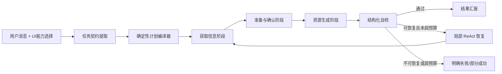

# 稳定型教学 Agent 能力优化 SPEC

> 日期：2026-08-09
> 状态：Task 11—17 智能升级已实现；L1/L2、真实 L3、双 Provider、长对话与浏览器 L4 核心验收通过
> 审计基线：`main@8eb20f7`（2026-08-09）
> 优先范围：教师端 Agent；学生端仅定义可复用角色策略，不实施学生端产品
> 调研依据：`docs/research/2026-08-09-stable-teaching-agent-open-source-research.md`
> 现状基线：`docs/acceptance/2026-08-09-agent-capability-status.md`
> 执行计划：`docs/superpowers/plans/2026-08-09-stable-teaching-agent-optimization.md`
> 验收规范：`docs/acceptance/2026-08-09-stable-teaching-agent-optimization-acceptance.md`

## 0. 代码现状审计（已完成）

本节保留对 `main@8eb20f7` 的历史审计结果，用于解释本轮改造的起点。审计发现的核心缺口已经进入代码并完成回归；当前事实以 0.5、16 和 17 节为准。

### 0.1 已实现，可直接复用

| 能力 | 代码事实 | 本轮处理 |
|---|---|---|
| UI 来源权威 | `request_normalizer.py` 已规范化 `selected_documents`、`course_auto`、`none`，所选文档会强制启用 RAG | 保留并纳入 `TeachingTaskContract` 输入护栏 |
| 强制检索 | Executor 会根据 capability 确定性调用 RAG/Web，检索无证据时阻止最终知识性回答 | 保留，移入编译计划与统一成功谓词 |
| 检索顺序修正 | Planner 的 `_ensure_mandatory_retrieval_when_enabled` 会合并检索步骤并移动到首位 | 由统一计划编译器替代，不保留双重权威 |
| 大纲确认边界 | 报告、PPT、教案首轮会移除生成步骤并等待确认 | 保留产品行为；PPT 不进入本轮新能力验收 |
| 明确单资源识别 | 教学博客、闪卡、思维导图、小游戏、AI 课堂、习题有关键词兜底和对应工具 | 迁入版本化意图规则，补齐多资源和控制意图 |
| 八类非 PPT 工具入口 | 工具注册和 durable Job 提交链路已存在，已有真实生成基线 | 不重写生成器，只收紧 Agent 侧契约 |
| 后台任务基础设施 | `GenerationCommand`、SQLite durable task store、Job 终态和结果引用已存在 | 复用；新增 Agent run 持久化和确定性幂等键 |
| 报告证据消费 | 报告会合并 RAG/Web 摘要、来源和图片，并记录 grounding 状态 | 作为统一 `ResearchBundle` 协议的参考实现 |
| 模型故障切换 | Planner、Executor 和部分生成链路已支持配置模型 fallback | 保留，补充统一错误分类与 trace |
| 基础 trace | 已记录工具、参数摘要、耗时、成功标志和部分证据数 | 扩展为任务契约、计划、预算、Job、材料和自检的完整 trace |

### 0.2 评审时部分实现（已完成核心收敛）

| 能力 | 当前缺口 | 目标状态 |
|---|---|---|
| 计划 | 当前 `PlanStep.internal_action` 仍是自由度较高的模型输出，依靠多个 `_ensure_*` 后置修正；没有依赖图、成功谓词和失败策略 | 模型只产出任务契约，代码编译枚举化 `CompiledPlan` |
| 工具白名单 | guided 模式主要隐藏提前生成工具；strict 模式在 `expected_tools=[]` 时会退回全部工具 | 空 allowlist 必须表示“禁止所有工具”；所有阶段调用前强校验 |
| 强制工具选择 | LLM 调用当前始终使用 `tool_choice="auto"` | 必需步骤使用 required/指定工具；等待确认和汇报阶段禁止工具 |
| 重试预算 | 有 `max_steps` 和 Reflect 重试计数，但默认每步可重试 2 次、总计 4 次，且没有独立的全局重规划计数 | 单步骤最多重试 1 次；整次任务最多重规划 1 次；预算耗尽明确终止 |
| Reflect | 可检查检索长度、来源、大纲和图片；工具返回 `ok=false` 时规则默认 `pass`，可能错误推进步骤 | 先按错误码处理执行事实，再运行内容质量评价；失败不得推进成功步骤 |
| 幂等 | 底层任务存储支持幂等，但 Agent 报告、教案、习题和其他资源处理器使用随机 UUID；AI 课堂也没有 Agent 逻辑任务键 | 同一逻辑任务在重试、重连、双实例和重启后命中同一 Job |
| 状态持久化 | LangGraph 使用进程级 `MemorySaver`；重启丢失大纲、计划和图片；每轮还会重置 `current_plan` | SQLite 持久化任务契约、计划、确认点、研究包引用、Job 和验证结果 |
| 研究证据 | 报告消费最完整；AI 课堂可消费研究文本；其他资源即使保存部分字段，也没有统一、可证明的消费协议 | 八类非 PPT 资源都接收同一 `ResearchBundle` 引用并报告消费结果 |
| 图片链路 | 已有报告图片搜索、审核和注入；尚未成为所有适用资源的共享协议 | 图片需求、候选、审核、位置和降级原因进入 `ResearchBundle` |
| 终态 | Agent 生成工具成功仅表示“Job 已提交”；真实冒烟脚本会在 Agent 外部轮询 Job 和材料 | Agent run 区分 accepted/running/succeeded/partial/failed；完成声明需材料可读 |

### 0.3 评审时未实现（历史基线）

- 版本化 `TeachingTaskContract` 和七类任务意图；
- 默认或显式教学材料包编排；
- 状态查询、取消、资源修改的 Agent 工作流；
- `PersonaPolicy` / `InteractionPolicy`；普通问答快速路径当前仍带有面向学生的启发、延伸学习和反问话术；
- 统一 `ResearchBundle`、`ToolObservation`、`VerificationReport`；
- Agent run SQLite 持久化与跨重启恢复；
- 确定性 Agent 幂等键；
- 版本化 Agent Eval Dataset、五次重复实验和结构化失败报告。

### 0.4 审计确认的 P0 风险（核心项已关闭）

1. strict 阶段的空工具列表不是 fail closed，等待确认/汇报阶段存在工具面扩大风险。
2. `tool_choice="auto"` 使必须调用的非检索工具仍依赖模型自觉。
3. 工具失败可被 Reflect 当作通过，步骤状态可能与执行事实不一致。
4. Agent 使用随机幂等键，重复确认或重试可能创建重复资源。
5. 进程重启会丢失 Agent 工作状态，不能满足恢复验收。
6. 任务提交成功不等于资源完成，运行时尚无材料可读性完成门禁。
7. 普通问答快速路径 Persona 与“教师备课助手”定位冲突。

上述风险已通过任务契约、计划编译器、严格工具边界、幂等键、SQLite run state、材料状态和教师 Persona 完成核心关闭；剩余发布级稳定性与体验门槛在第 17 节继续实施。

### 0.5 2026-08-09 实施记录

本轮已将审计中的核心编排风险落到代码和测试中：

| 范围 | 已实施事实 |
|---|---|
| 任务与角色 | 新增版本化 `TeachingTaskContract`、确定性提取器，以及教师/学生 `PersonaPolicy`；Fast 与 Agent 提示词均采用教师备课助手定位 |
| 计划 | 新增固定模板编译器，覆盖 QA、单资源、默认材料包、确认、修改大纲、状态、取消；Planner 不再把自由 LLM 计划作为执行事实 |
| 工具护栏 | 空 allowlist 严格关闭；当前步骤 schema 过滤与执行前二次校验一致；无工具步骤使用 `tool_choice=none`，单工具必需步骤使用 `required` |
| 恢复与审计 | 工具 `ok=false` 先按错误与失败策略处理，失败不会推进必需步骤；新增 `VerificationReport`，检查白名单、顺序、重复提交、grounding 和材料状态 |
| 状态与幂等 | Agent run 写入 SQLite；资源生成键由逻辑任务、契约和参数确定；课堂生成补齐 owner/course scoped 幂等复用；状态查询返回 Job 与材料引用可读性 |
| 研究证据 | 新增 `ResearchBundle`；报告、教案、习题、博客、闪卡、导图、小游戏和 AI 课堂均将研究上下文送入实际生成输入，并在产物/任务元数据保留 bundle 消费证据 |
| 长对话验收 | 新增 `smoke_teacher_agent_generation.py --cases long-dialogue --long-dialogue-turns 12`：验证大纲保留、修订后确认、单次提交、Job/材料与后续状态查询 |

最终本地验证已通过 1369 项后端全量回归（2 skipped）、223 项前端测试、Python 编译检查、前端生产构建和差异格式检查。真实服务已覆盖普通问答、course_auto/selected RAG、Web、RAG+Web、图片检索、八类资源、默认材料包、Job/材料读回、结构化审计和 12 轮长对话；自动化另覆盖 50 轮记忆与完整故障注入。L4 浏览器核心流程、双 Provider 连续五次和结构评测五次重复均已通过。

## 1. 产品定位

### 1.1 教师端

教师端 Agent 是“帮助教师完成备课工作的教学助手”，不是“教教师学习知识的老师”。它的首要职责是减少教师查资料、组织内容、填写配置和等待资源生成的负担。

教师端应表现为：

- 先理解教师要完成的工作，再行动；
- 能自己采用合理默认值，不把资源配置表改写成连续追问；
- 明确告诉教师正在准备什么、还需要什么确认、最终生成了什么；
- 对普通知识问题给出简洁、面向教学使用的答案，不采用学生式循循善诱；
- 不重复讲解显然属于教师专业常识的基础概念；
- 不频繁使用“老师您好”“让我们一步步学习”等增加距离或误判角色的话术；
- 只有缺少会显著改变结果或产生高成本任务的信息时才追问，一次最多问一个问题。

建议语气：

```text
我会先结合已选课程资料梳理快速排序的教学重点，再补充必要案例，
为你准备教案、练习题和一张思维导图。开始生成前我会先给你确认材料结构。
```

不建议语气：

```text
老师，让我们先来学习什么是快速排序。你知道它为什么叫快速排序吗？
```

### 1.2 学生端预留

学生端未来复用同一套意图、计划、工具和验证内核，但切换为“引导式教师”角色：

- 对学习问题优先给提示、示例和检查理解的问题；
- 在一个知识点的关键位置进行反问，而不是每句话都反问；
- 根据学生回答调整提示深度，再给完整结论；
- 资源工具调用规则与教师端一致，但受学生权限和可见资源范围限制。

本阶段不实现学生页面、学生权限或学生 Agent，只建立 `PersonaPolicy` / `InteractionPolicy` 接口和单元测试，避免未来复制整套编排。

## 2. 设计目标

1. 明确任务路由：正确区分普通对话、单资源生成、教学材料包、修改、任务状态、取消和确认。
2. 稳定工具规划：RAG、Web、图片和资源生成按照用户选择与固定依赖顺序执行。
3. 降低模型自由度：模型不再生成任意流程，只填充结构化任务契约；代码将契约编译成模板计划。
4. 有界 ReAct：只在当前阶段内处理观察、补充检索和一次错误恢复。
5. 工具调用可靠：阶段白名单、严格参数、幂等提交、超时、重试和终止条件齐全。
6. 统一研究证据：同一次备课任务只构建一份 `ResearchBundle`，供全部资源生成器复用。
7. 结果可验证：每一步都有机器可判定的成功条件，最终材料必须真实落库且可读取。
8. 角色一致：教师端以完成备课为中心，学生端未来以引导学习为中心。
9. 可评测：建立固定数据集、多次重复实验、故障注入和真实端到端验收。

## 3. 非目标

- 不建设通用自治 Agent、开放式研究 Agent 或代码执行 Agent。
- 不引入 supervisor、critic team、swarm 等多 Agent 架构。
- 不让模型创建新工具、任意 DAG 或长期目标。
- 不追求复杂任务分解、跨天自主执行或无人监督的循环改进。
- 不在本轮实施 PPT 新能力；PPT 继续按产品决策后置。
- 不在本轮实施学生端产品。
- 不更换 LangGraph，不迁移到 Dify、AutoGen、PydanticAI 或其他运行时。

## 4. 总体架构

### 4.1 “工作流在外，Agent 在内”



外层阶段和依赖由代码控制；ReAct 只能在当前允许阶段内选择工具。模型不能把生成提前到检索之前，也不能在自检阶段再次提交资源。

### 4.2 单 Agent，而非多 Agent

系统只保留一个面向用户的 Agent。Planner、Retriever、Generator、Verifier 是图节点或服务职责，不是互相对话的独立人格。这样可以减少：

- 模型调用次数；
- 上下文复制；
- 状态同步错误；
- 角色冲突；
- 终止条件不清；
- 调试和验收成本。

## 5. 核心领域契约

### 5.1 `TeachingTaskContract`

模型只负责从自然语言提取以下结构，之后由代码校验和补默认值：

```text
schema_version
actor_role: teacher | student
intent: qa | generate_single | prepare_bundle | modify | confirm | status | cancel
topic
resource_types[]
audience?: string
lesson_duration?: integer
teaching_goals[]
constraints{}
source_mode: selected_documents | course_auto | none
selected_document_ids[]
web_policy: required | allowed | disabled
image_policy: required | allowed | disabled
confirmation_policy: required | optional | none
conversation_refs{}
```

约束：

- `source_mode`、文档 ID、Web 和图片开关以 UI 能力状态为权威，模型不能关闭用户已启用能力；
- 用户明确说出的资源类型覆盖模型分类；
- 模型不得虚构受众、课时和教学目标；缺失时使用课程默认或资源默认；
- 只有高影响缺失项才触发追问；明确单资源任务不得因非必填参数追问。

### 5.2 `CompiledPlan`

计划不再以自由文本步骤为事实来源，而使用固定字段：

```text
plan_id
template_id
contract_version
steps[]:
  step_id
  kind: retrieve_rag | retrieve_web | retrieve_images | prepare_outline |
        await_confirmation | generate_resource | verify | report_result
  required: bool
  depends_on[]
  tool_allowlist[]
  success_predicate
  failure_policy: retry | supplement | partial | stop
  max_attempts
  timeout_seconds
  state: pending | running | awaiting_user | succeeded | failed | skipped
  input_refs[]
  output_refs[]
budgets{}
```

所有计划在执行前通过编译器校验：

- 步骤类型必须属于枚举；
- 依赖必须无环；
- 检索必须先于依赖证据的生成；
- 图片必须先于需要图片的正文/资源组装；
- 确认必须先于需要确认的生成任务；
- 自检必须在所有生成任务之后；
- 每个生成步骤只能包含一个明确资源工具；
- 相同幂等键的生成步骤不能重复。

补充约束：

- `await_confirmation`、`verify` 和 `report_result` 的工具白名单可以为空；空列表必须严格解释为“禁止调用任何工具”，不得退回全量工具；
- `depends_on` 只能引用同一计划中的先前步骤，计划必须通过无环校验；
- `generate_resource` 的成功只表示已获得合法 `job_id`，不能直接把步骤或任务标记为最终完成；
- `status`、`cancel`、`modify` 和 `confirm` 使用专用模板，不得通过普通生成计划猜测执行；
- 模型输出不合法时，由确定性模板 fail closed；禁止把原始自由计划直接交给 Executor。

### 5.3 `ResearchBundle`

一次备课任务共享一份研究包：

```text
topic
course_evidence[]
web_evidence[]
visual_assets[]
citations[]
source_mode
queries[]
quality_summary
missing_evidence[]
created_at
```

所有资源生成器读取同一研究包，而不是各自重新检索或只在命令快照中保存未使用的上下文。

`ResearchBundle` 必须版本化并通过引用传递。Trace 只记录 bundle ID、来源数量、质量摘要和引用 ID，不记录完整私有文档正文。

### 5.4 `VerificationReport`

自检输出必须结构化：

```text
plan_compliance
required_tools_satisfied
forbidden_tools_absent
tool_order_valid
duplicate_submission_absent
grounding_valid
artifact_contract_valid
artifact_readable
persona_valid
warnings[]
decision: pass | partial | retry | fail
```

### 5.5 `ToolObservation` 与错误契约

所有工具统一返回：

```text
observation_id
tool_name
stage
attempt
status: succeeded | accepted | running | failed | cancelled | timed_out
error_code?: validation_error | transient_provider_error | retrieval_empty |
             permission_denied | job_timeout | job_failed | contract_violation |
             artifact_unreadable | unknown_error
recoverable: bool
summary
evidence_refs[]
job_id?
result_ref?
duration_ms
```

工具元数据必须声明允许阶段、输入模型、副作用等级、是否需要幂等、超时、最大尝试次数、成功谓词及可恢复错误。Executor 不再从自由文本判断成功。

### 5.6 `AgentRunStatus`

任务终态使用统一枚举：

```text
awaiting_confirmation | accepted | running | succeeded | partial |
failed | cancelled | timed_out
```

- `accepted`/`running` 是合法中间态，前端可立即展示任务入口；
- 只有 Job `succeeded`、`result_ref` 存在、材料可读取且自检通过时，才可声明资源完成；
- 材料包部分项目失败时使用 `partial`，保留已成功资源；
- 超时仅结束前台等待，不得触发重复提交。

## 6. 意图与计划模板

### 6.1 意图优先级

按以下顺序判定：

1. 取消、状态、确认、修改等工作流控制指令；
2. 用户明确说出的资源类型；
3. “教学材料/备课材料/整套材料”等组合意图；
4. 普通知识或教学设计问答；
5. 仍然模糊时才调用结构化意图模型。

明确关键词由代码规则确定，避免“教学博客”再次被模型误判为报告。

### 6.2 普通问答模板

```text
可选 RAG/Web 获取信息 → 证据检查 → 面向教学使用的简洁回答
```

教师端回答结束可提供一个轻量下一步，例如“需要的话我可以把它整理成课堂讲解提纲”，但不得擅自创建资源。

### 6.3 单资源模板

```text
解析参数
→ 按能力获取 RAG/Web
→ 如资源或用户要求配图则获取图片
→ 如该资源要求确认则准备结构并等待确认
→ 调用唯一资源工具
→ 等待 Job 终态并读取材料
→ 自检
→ 汇报
```

### 6.4 教学材料包模板

用户只说“帮我准备快速排序的教学材料”时，采用低成本默认核心包：

- 教案；
- 练习题；
- 思维导图。

理由：三者覆盖课堂组织、学习检查和知识结构，且不会默认启动耗时很长的 AI 课堂。报告、博客、闪卡、小游戏、AI 课堂需要用户明确提出，或课程偏好中已保存为默认包。

执行过程：

```text
获取共享 ResearchBundle
→ 给出一条简洁材料包确认（核心包、主题、来源，以及需要确认的教案/报告结构）
→ 教案生成
→ 练习题与思维导图可并行生成
→ 逐项自检
→ 汇报全部成功、部分成功或失败项
```

材料包只允许一次合并确认。若包含教案或报告，其结构预览必须并入同一确认卡；不得先确认材料类型、再逐项确认参数。AI 课堂属于高耗时分支，即使出现在材料包中也要在确认卡中单独标识成本和异步行为。

如果教师已保存个人默认材料包，可以直接采用该偏好，并在状态卡中显示“按你的默认材料包准备”，不再追问。

### 6.5 明确的 Web/RAG/图片顺序

- 勾选文档：`rag_search` 是强制步骤，且只检索所选文档；
- 选择课程全部资料：`rag_search` 是强制步骤，在全课程中按主题检索；
- 未选择知识库：不调用 RAG；
- 用户说“查找网络/参考最新资料”：`web_search` 是强制步骤；
- 用户要求配图，或资源模板声明必须有图：`image_search` 在生成前执行；
- RAG 证据不足且 Web 仅为 `allowed`：可执行一次 Web 补充；
- 任何强制检索失败都不得静默用模型常识伪装成检索结果。

## 7. 有界 ReAct 设计

### 7.1 循环结构

```text
Observe（结构化状态与上一步结果）
→ Decide（只在当前 allowlist 中选择下一行动）
→ Act（执行一个或一组无依赖冲突的工具）
→ Verify（代码规则优先）
→ Continue / Retry once / Replan once / Stop
```

### 7.2 预算

默认预算：

- 普通问答：最多 2 个模型轮次、2 次工具调用；
- 单资源：最多 4 个模型轮次、4 次前台工具调用；后台生成 Job 不计入模型轮次；
- 材料包：最多 5 个模型轮次；
- 单步骤最多重试 1 次；
- 整体最多重规划 1 次；
- 不可逆生成工具每个资源最多成功提交 1 次；
- 达到预算时返回部分结果和明确原因，不继续循环。

### 7.3 重规划触发条件

只允许以下情况重规划：

- RAG 返回空结果且 Web 被允许；
- 图片结果全部不合格且存在备用查询；
- 工具明确返回可恢复参数错误；
- 某个材料包子任务失败，但其他子任务仍可继续。

模型回答质量一般、写作风格不理想或“觉得还可以更好”不触发自动重规划。

## 8. 工具契约与执行护栏

### 8.1 阶段工具白名单

| 阶段 | 允许工具 |
|---|---|
| 获取信息 | `rag_search`、`web_search`、`image_search` |
| 准备结构 | `draft_outline` |
| 等待确认 | 无工具 |
| 生成 | 当前计划指定的一个或多个 `generate_*` |
| 自检 | 只读任务/材料读取，不暴露生成工具 |
| 汇报 | 无工具 |

### 8.2 幂等和重复提交防护

每个生成工具调用必须携带：

```text
logical_task_id = 首次创建任务契约时生成并持久化的稳定 ID
idempotency_key = sha256(owner_id + course_id + conversation_id +
                         logical_task_id + resource_type + contract_hash)
```

- 相同键已存在成功或运行中 Job：返回原 Job，不重复创建；
- 重规划不得更换 `logical_task_id`，否则会绕过幂等；
- 超时只表示前台等待结束，不表示任务失败，不得重新提交；
- 用户修改主题、资源类型或关键配置后生成新的 contract hash；
- 工具结果必须返回 `job_id`、`accepted_at`、`result_ref` 或明确错误码。

### 8.3 错误分类

- `validation_error`：修正参数后重试一次；
- `transient_provider_error`：按现有模型 fallback 和退避策略重试；
- `retrieval_empty`：按策略补 Web 或向用户说明；
- `permission_denied`：立即停止，不重试；
- `job_timeout`：转后台并给任务入口，不重复提交；
- `job_failed`：显示资源类型和失败原因，材料包其他项继续；
- `contract_violation`：停止并记录为系统缺陷。

### 8.4 工具选择策略

- 强制 RAG/Web、确定性生成步骤：使用 required 或指定工具调用；
- 可选补充检索：仅暴露当前阶段允许的候选工具并使用 `auto`；
- 等待确认、自检规则判定和结果汇报：不暴露写工具；
- 空白 allowlist：禁止所有工具；
- 任何阶段越权调用在执行前返回 `contract_violation`，不得依赖工具处理器自行拒绝。

## 9. 自检策略

自检采用“代码规则优先、模型评价补充”：

### 9.1 必须由代码判定

- required tool 是否全部执行成功；
- 实际工具顺序是否满足依赖；
- 是否出现未授权或非当前阶段工具；
- 是否重复提交；
- Job 是否达到合法终态；
- `result_ref` 是否存在；
- 材料是否可读取；
- RAG/Web/图片证据是否被目标生成器实际消费；
- 输出是否符合资源 schema。

### 9.2 可由模型或人工抽检

- 教学目标与内容是否一致；
- 练习难度是否适合受众；
- 图片与段落是否语义匹配；
- 教师端语气是否简洁、行动导向；
- 学生端未来是否体现提示、反问和渐进式教学。

LLM 自检最多一次，不因风格评分自动重做整份资源。

## 10. 对话与确认策略

### 10.1 不追问的情况

- “生成一份快速排序报告”；
- “按已选文档生成链表教案”；
- “查找网络并生成二分查找的思维导图”；
- 缺少篇幅、难度等有安全默认值的可选配置。

### 10.2 需要一次确认的情况

- 泛化的“准备教学材料”，且教师没有保存默认材料包；
- 报告、教案等需要先确认内容结构的资源；
- 启动 AI 课堂等高耗时任务；
- 用户同时要求多个可能冲突的资源或范围。

确认信息必须合并成一条简洁卡片，不能逐字段提问。

### 10.3 修改、取消和状态

- “把练习题改简单一些”：绑定最近成功或运行中的练习任务，不重新规划无关资源；
- “取消”：取消当前可取消 Job，并返回哪些任务已经完成、哪些已取消；
- “做到哪了”：读取任务账本，不调用生成工具；
- 多个候选任务时只问一次“你指的是哪一项”。

## 11. 角色策略

### 11.1 教师 `PersonaPolicy`

```text
goal: complete_teaching_preparation
default_style: concise_action_oriented
clarification_budget: 1
socratic_mode: off
offer_next_action: true
avoid_basic_tutoring_tone: true
```

教师端响应模板：

- 开始：说明将完成什么和采用哪些来源；
- 等待确认：只展示关键结构和可调整项；
- 运行中：展示任务和进度，不输出内部思维；
- 完成：列出材料、入口、来源使用和警告；
- 失败：说明失败项、已完成项和可执行下一步。

该策略必须同时作用于快速问答路径和 Agent 工具路径。不得只修改 Agent system prompt，而让普通问答继续使用面向学生的启发式教师提示词。

### 11.2 学生 `PersonaPolicy` 预留

```text
goal: guide_learning
default_style: encouraging_guided
clarification_budget: 1
socratic_mode: checkpoint
hint_before_full_answer: true
reflection_question_budget_per_topic: 1
```

学生策略只改变沟通与最终回答，不改变工具执行事实、权限、来源和自检标准。

## 12. 状态持久化与可观察性

当前进程级 MemorySaver 不能跨服务重启保留确认和计划状态。优化后至少持久化：

- `TeachingTaskContract`；
- `CompiledPlan` 与步骤状态；
- `ResearchBundle` 引用；
- 用户确认点；
- Job 与材料引用；
- 重试、重规划和预算消耗；
- 最终 `VerificationReport`。

实现采用与现有 durable task store 一致的 SQLite 基础设施，新增独立的 Agent run/step/reference 表；不把每个高频步骤继续写入整文件 JSON 对话存储。LangGraph checkpointer 可以作为运行时缓存，但不能成为事实来源。

每次运行产生统一 trace：

```text
trace_id, conversation_id, actor_role, intent, template_id,
model/provider attempts, plan steps, tool calls, durations,
guardrail decisions, job_ids, material_ids, verification, final_status
```

日志默认不保存令牌、完整私有文档正文或不必要的模型隐藏推理。

## 13. 性能与可靠性指标

### 13.1 核心指标

| 指标 | 目标 |
|---|---:|
| 明确任务意图准确率 | ≥ 98% |
| 明确资源类型准确率 | 100% |
| 必需工具召回率 | 100% |
| 禁止工具调用率 | 0% |
| 工具顺序合规率 | 100% |
| 不可逆工具重复成功提交 | 0 |
| 清晰请求无谓追问率 | ≤ 5% |
| 同一用例五次运行计划合规稳定率 | ≥ 98% |
| 自动化 E2E 任务成功率 | ≥ 95% |
| Trace 完整率 | 100% |
| 教师角色语气合规率 | ≥ 95% |

### 13.2 响应目标

- 首个状态事件：本机环境 P95 ≤ 2 秒；
- 任务契约与计划形成：可用模型条件下 P95 ≤ 10 秒；
- 后台资源任务提交后立即返回任务状态，不同步等待 AI 课堂完成；
- 外部供应商耗时单独统计，不与 Agent 编排耗时混为一个指标。

## 14. 关键决策记录

| 决策 | 选择 | 原因 |
|---|---|---|
| Agent 数量 | 单 Agent | 当前任务短且工具固定，多 Agent 增加不稳定性 |
| 编排方式 | 固定模板 + 有界 ReAct | 同时保留自然语言适应性和确定性 |
| 框架 | 保留 LangGraph | 当前代码和测试已建立，无迁移收益 |
| 工具调用 | 结构化 Tool Calling | 比代码执行更安全、可验证 |
| 默认教学材料包 | 教案 + 练习题 + 思维导图 | 覆盖备课核心且避免默认高成本任务 |
| 高成本任务 | 显式请求并确认 | AI 课堂耗时长，不能因模糊意图自动启动 |
| 自检 | 规则优先，LLM 补充 | 降低随机性和循环重做 |
| 学生端 | 共享内核、分离角色策略 | 防止未来复制和行为漂移 |

## 15. 完成定义

只有同时满足以下条件，Agent 优化才可签收：

1. 本 SPEC 的契约、模板、工具护栏、幂等和自检全部落地；
2. 教师端语气通过规则、LLM Judge 和人工抽检；
3. 固定评测集在至少两个可用模型通道上达到指标；
4. 所有真实 E2E 用例验证实际工具、Job 终态、材料落库和内容证据；
5. 故障注入覆盖 RAG 空结果、Web 失败、模型 fallback、参数错误、超时、重启和部分任务失败；
6. 同一关键用例至少重复五次，稳定性指标达标；
7. PPT 延期与学生端未实施不计为本轮失败，但不得被误报为已支持；
8. 验收文档填写真实结果、任务/材料证据、耗时和未通过项，不允许只写“工具已调用”。

## 16. 实施结果（2026-08-09）

本轮实现已落地任务契约、模板计划编译、阶段工具白名单、检索研究包、SQLite Agent 运行状态、幂等提交、规则优先的 `VerificationReport` 与教师 Persona。生成后的终态由服务端确定性汇报：它不再把已完成计划交回模型取得新的工具权限，因此保留完整的工具轨迹和结构化审计，而不会因严格模式拒绝额外状态查询而覆盖成功结果。

已在重启后的真实 8001 服务验证联网报告链路：`web_search → generate_report → verify_task`，10 条 Web 来源进入生成配置和材料 grounding；最终 SSE 响应包含计划合规、必需/禁止工具、顺序、重复提交、grounding、材料契约、Persona 与决策字段。12 轮真实连续对话亦验证了大纲保持、修改生成新大纲、确认后单次提交以及最后仅查询任务状态。

本轮核心工作流与第二阶段智能升级均已验收：版本化数据集连续五次、双 Provider 连续五次、故障注入、50 轮记忆、八类资源、默认材料包和教师端浏览器流程均有独立证据。PPT 与学生端仍按既定范围明确延期，不计入本轮成功数。

## 17. 第二阶段：Agent 智能优化 SPEC（已实施）

### 17.1 阶段目标

本阶段在稳定编排基础上提升“在规则边界内是否能做出更好的教学工作”。已实现的目标闭环为：

```text
准确理解任务
→ 主动补全可安全推断的信息
→ 选择最低成本且充分的资料来源
→ 形成可解释的教学工作计划
→ 正确调用并复用工具结果
→ 对材料质量和执行事实分别审计
→ 在长对话中持续维护任务状态
→ 根据评测结果持续优化
```

### 17.2 核心能力

| 能力域 | 稳定基础 | 本阶段实现 |
|---|---|---|
| 任务理解 | 规则优先的 `TeachingTaskContract` | 增加字段来源、置信度、冲突和缺失原因；仅对高影响歧义追问一次 |
| 计划智能 | 固定模板编译，执行稳定 | 按任务规模、来源质量和资源依赖选择模板；允许模型提出受限参数，不允许改写安全顺序 |
| 研究智能 | RAG/Web 可组合并形成 `ResearchBundle` | 查询分解、来源去重、可信度分层、证据覆盖检查和证据不足时的有界补检索 |
| 工具决策 | 阶段 allowlist 与 required tool choice | 在允许集合中依据成本、时延、证据增益和历史结果选择；避免无收益的重复调用 |
| 生成质量 | 八类资源可消费统一研究上下文 | 资源级教学质量契约：目标、学情、课堂活动、评价和引用必须可核验 |
| 自检恢复 | 规则优先 `VerificationReport` | 分离执行审计、证据审计、材料审计和 Persona 审计；只重做失败的最小步骤 |
| 长对话记忆 | SQLite 保存任务、计划、确认和 Job | 引入工作记忆、任务账本和对话摘要三层结构；50 轮后仍能绑定正确任务与约束 |
| 评测闭环 | 单元、集成和真实冒烟 | 建立版本化 Eval Dataset、五次重复、双 Provider 对照、失败聚类与回归阈值 |

### 17.3 智能边界

- 继续采用单 Agent、固定模板和有界 ReAct，不迁移为开放式多 Agent。
- 模型可以补全教学参数、提出检索词和内容结构，但不能扩大权限、来源范围或工具白名单。
- 模型判断不能覆盖 Job、材料、权限、调用次数和来源等执行事实。
- 不增加任意代码执行能力；所有外部动作继续通过结构化工具完成。
- 默认采用低成本路径；只有证据不足、质量门禁失败或用户明确要求时才升级检索/模型成本。
- PPT 和学生端产品继续不在本阶段范围内，学生 `PersonaPolicy` 仅作为共享内核扩展点。

### 17.4 新增验收指标

| 指标 | 门槛 |
|---|---:|
| 版本化离线用例数 | ≥ 80 |
| 任务契约字段准确率 | ≥ 98% |
| 高影响歧义识别召回率 | ≥ 95% |
| 清晰请求无谓追问率 | ≤ 5% |
| 检索证据覆盖率 | ≥ 95% |
| 无收益重复工具调用率 | ≤ 2% |
| 50 轮任务绑定准确率 | 100% |
| 同一关键用例五次执行合规率 | ≥ 98% |
| 双 Provider 核心用例通过率 | ≥ 95% |
| 教师 Persona 合规率 | ≥ 95% |
| 结构化审计与执行事实一致率 | 100% |

### 17.5 实施优先级

1. 建立 Eval Dataset 和统一评分器，先固定“智能”的可测定义。
2. 升级任务契约与三层记忆，解决复杂请求和长对话任务绑定。
3. 实现查询分解、证据覆盖和检索成本策略。
4. 实现资源级教学质量契约与最小步骤修复。
5. 完成五次重复、双 Provider、故障注入和浏览器验收。

本阶段不得以新增提示词数量作为完成证据；实际签收使用版本化用例、trace、材料和重复实验结果证明能力提升。

## 18. 智能升级最终结果

### 18.1 已落地能力

- `TeachingTaskContract` v2 为意图、主题、资源、学情、时长、来源和确认策略记录来源、置信度与歧义；
- 三层记忆分离原始消息、工作记忆和任务账本，确认点、约束、Job 与材料引用不被摘要丢弃；
- 研究计划将复杂任务拆成问题与证据需求，按覆盖缺口执行最多一次补检索；
- 工具策略在编译计划 allowlist 内按质量增益、成本、预算和历史结果决策；
- 八类非 PPT 资源具有结构化质量契约，`VerificationReport` 分离执行、证据、材料与 Persona 审计；
- 修复策略只重试失败步骤，已经成功的不可逆 Job 不会因其他步骤失败而重复提交；
- 确认态完整继承材料包资源集合、图片需求、来源和主题约束；无工具步骤和单工具步骤均由服务端收紧权限；
- 版本化评测、双 Provider 冒烟、真实生成、长对话和浏览器流程形成可重复验收资产。

### 18.2 验收数字

| 项目 | 结果 |
|---|---:|
| 版本化离线数据集 | 80 个用例 |
| 五次重复 | 400/400，100% |
| 双 Provider 连续五次 | 20/20，100% |
| 50 轮任务绑定/隔离 | 100% |
| 八类真实资源 | 8/8 成功落库 |
| 默认材料包 | 3/3 Job 成功并可预览 |
| 浏览器核心流程 | 确认、进度、预览、取消、重载、重启恢复、partial 均通过 |

详细命令、Provider 标识、Job/材料证据、未纳入范围和最终全量回归数字以验收文档为准。敏感令牌、私有文档全文和模型隐藏推理未写入任何报告。
