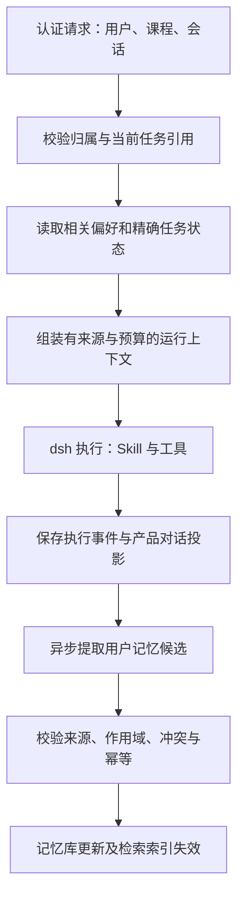

# DeepSeek Harness 接入：记忆与任务状态设计

日期：2026-09-07。状态：目标设计，尚未接入生产。源码核查基线：`b045484adb8039a6f5c3f6392a5d1b8ff22fdf30`。

本文整理已经讨论的记忆方案，并说明现有代码的复用位置。配套阅读：[功能拆分审查](deepseek-harness-capability-decomposition-cn.md)、[Agent 与 Skills 设计](deepseek-harness-agent-skills-design-cn.md)。

## 1. 决策

DeepSeek Harness（下称 dsh）负责模型运行时的会话历史、工具执行事件与上下文压缩；Edu_AI 负责用户长期记忆、课程内偏好、身份与访问控制，以及任务和学习数据的权威记录。

沿用现有 Python `AgentMemoryService` 和 SQLAlchemy 存储，通过适配层接入 dsh。第一阶段不另外引入一套记忆平台。向量检索是可选的检索手段，不作为记忆有效性或权限的判断依据。

“记得用户说过什么”“任务执行到了哪里”“学生实际完成了什么”必须分开保存。

## 2. Harness 能提供什么

| 能力 | 上游事实 | 本系统仍需负责 |
| --- | --- | --- |
| 会话历史 | dsh 以追加式 SessionEvent 日志构造模型历史 | 部署持久化配置、用户与会话归属映射、事件同步、重启验证 |
| 上下文压缩 | compaction 插件可总结较早历史并保留近期内容；摘要有损 | 保留原始事实引用，重新注入准确任务状态，验证所选 profile 实际启用插件 |
| 长期记忆扩展 | 官方提供外部 MCP 记忆服务的参考配置，默认不启用 | 记忆采集、归属、冲突、更正、删除、访问控制与数据库 |

依据：[官方架构](https://github.com/deepseek-ai/deepseek-harness/blob/master/docs/architecture.md)、[压缩插件](https://github.com/deepseek-ai/deepseek-harness/blob/master/packages/compaction/compaction-basic/README.md)、[MCP 记忆说明](https://github.com/deepseek-ai/deepseek-harness/blob/master/docs/user/guide/mcp-memory.md)。上游 master 会变化，落地时应固定版本并保存实际 profile 配置。

前期实验使用 Python SDK `0.1.2rc1`，源码阅读版本为 `d347e703908d0406b7a7ef80e3a0e594d86b2215`，两者不能混同。报告大纲实验只证明 Skill 加载与 MCP 工具调用。此前最小配置实验中，同进程可延续历史，关闭后用相同 session ID 重开没有恢复原历史；因此不能据此宣称持久化记忆已经可用。`sdk-minimal` 也不能被当作自动包含完整持久化、Skills 和压缩配置的产品运行环境。

## 3. 五类数据与归属

| 类型 | 例子 | 保存位置／作用域 | 读取方式 |
| --- | --- | --- | --- |
| 用户长期偏好 | “以后报告都先给结论” | 用户记忆；用户级 | 请求开始时注入少量相关偏好 |
| 课程内偏好 | “这门课面向零基础，例子尽量用生活场景” | 用户＋课程记忆；不自动成为全班共享事实 | 当前课程过滤后读取 |
| 对话记忆 | 用户消息、工具结果、上轮讨论纪要 | dsh 执行日志＋产品对话投影；会话级 | 近期历史、摘要、按需历史检索 |
| 任务状态 | 报告主题、确认的大纲版本、job_id、失败原因 | 业务任务库；任务级 | 每轮从权威记录重建 |
| 业务事实 | 成绩、学习进度、课程成员、教材内容 | 对应业务库与知识库 | 业务查询工具／有权限的 RAG |

“本次报告分五章”进入任务约束，不能自动变成长期偏好。“我已经掌握递归”可以是用户自述，不能改写平台的学习完成记录。“我是老师”不能提升角色权限。

课程共同规则如教学大纲、教师发布的课程要求，应作为课程配置或资料管理，不与某个用户的个人课程偏好混放。

## 4. 当前代码与差距

| 位置 | 已有实现 | 接入前处理 |
| --- | --- | --- |
| [memory/domain.py](../../backend/src/app/chat/memory/domain.py) | 候选记忆、归属与来源字段、画像轴、失效时间、上下文模型 | 复用；补齐来源消息 ID、版本／撤销关联等缺失契约，避免重复建模 |
| [memory/service.py](../../backend/src/app/chat/memory/service.py) | `persist_turn`、候选抽取与来源校验、`read_for_agent`、预算裁剪 | 为 dsh 包装读写入口；增加消息级幂等与可恢复异步处理 |
| [memory/policy.py](../../backend/src/app/chat/memory/policy.py) | 记忆类型白名单、临时约束与受保护事实判断 | 保留规则，扩展针对引用文本、否定、更正和跨课程的验收 |
| [memory/repository.py](../../backend/src/app/chat/memory/repository.py) | SQLAlchemy 查询、画像、更替／失效、审计 | 核查全部读写的 owner/subject/course 隔离；补齐删除后的派生数据失效 |
| [memory/dependencies.py](../../backend/src/app/chat/memory/dependencies.py) | 数据库服务装配、LangMemAdapter；缺 DATABASE_URL 时返回不可用服务 | 把可用性显式呈现给运行层，不能空读取后宣称“已记住” |
| [reply_service_v2.py](../../backend/src/app/chat/application/reply_service_v2.py) | 已接 memory_reader、memory_writer | 迁移调用位置，保证流式、非流式和异常结束语义一致 |
| [runtime/memory/manager.py](../../backend/src/app/chat/runtime/memory/manager.py) 与 [conversation_memory_compactor.py](../../backend/src/app/chat/orchestrator/conversation_memory_compactor.py) | 旧运行时工作记忆与会话压缩 | 逐步停止重复压缩／写入，保留需要迁移的数据 |

当前 `read_for_agent` 虽接受 conversation_id 和 task_id，正文主要读取画像与相关记忆；不能认为它已经恢复了任务。预算函数目前用字符数近似 token，还设置最低保留量，正式接入需使用统一预算器。

当前候选后台抽取经进程内 executor 调度；“异步执行”不等于“进程崩溃后必达”。需要补做可靠投递和重复消费验证。

## 5. 每轮读写流程

读取规则：

1. 用户、课程、角色、可见资料范围由认证请求生成，模型不能自行填写 owner 来扩大范围。
2. 当前请求的明确要求优先于课程内个人偏好，课程内个人偏好优先于全局个人偏好；三者都必须服从业务权限与硬性规则。
3. 首轮自动读取相关偏好，不依赖模型是否想起调用记忆工具。历史细节可通过 `search_conversation_history`、`read_memory` 等拟议工具按需读取。
4. 注入记录携带 memory_id、来源、作用域、版本；记忆和检索内容是参考数据，不能覆盖系统指令。
5. “继续刚才的报告”先解析明确 task_id。多个候选无法确定时澄清，不按最近一份大纲盲目继续。

写入规则：

1. 原始用户消息先可靠入库，候选抽取以消息 ID 幂等投递；不能只依赖正常生成完成回调。
2. 模型只提出候选。服务检查候选是否有用户原话支持，以及是否属于稳定偏好、临时约束、引用或用户自述。
3. 来源是用户消息不代表内容都代表用户本人；“某篇文章说我喜欢……”等引用不能直接归入画像。
4. 同一画像轴在同一作用域内更正，保留 supersedes 关系；跨课程的相似内容不能直接合并。
5. 无充分依据的推断不提升为长期事实。自动抽取失败不应导致本轮报告失败，但必须记录并可重试。

## 6. 数据契约与一致性

以下是目标逻辑字段，需与现有模型映射后做增量迁移，不要求机械新增同名表。

| 记录 | 必须表达的内容 |
| --- | --- |
| Memory | memory_id、owner/subject、scope、course_id、type/profile_axis、content、source_message_id/source_span、status、version、created/updated、expires_at、supersedes |
| ConversationMapping | 产品 conversation_id、用户与课程归属、dsh session_id、runtime/profile 版本、持久化定位、同步游标 |
| Task | task_id、任务约束、状态版本、outline_id/revision、approval 引用、job_id、artifact_id/version、verification、取消与失败原因 |
| EventProjection | 来源 session/event 唯一标识、产品 event_id、消息或工具关联、同步状态；使用唯一键避免重复 |
| MemoryExtractionJob | source_message_id、提取器版本、状态、重试次数、候选写入结果 |

一致性约定：

- 产品用户消息有稳定 ID；进入 dsh 时记录关联，重试不能重复入场。dsh 是执行事件的来源，前端展示记录是执行日志的投影，不让两份历史双向自由覆盖。
- 任务记录是审批与执行进度的权威来源。会话摘要只保存任务引用和便于理解的说明。
- 执行事件与业务提交跨系统不能假设同一事务；用稳定 operation_id、业务库唯一约束、事件 outbox／对账补齐。不能仅依靠 Python 进程锁。
- 压缩后，仍从任务库加载当前大纲版本及审批信息。用户改纲会使旧版本审批失效。
- 重启或断流后先读任务状态，再决定继续；模型没有看到工具结果不代表工具没执行，提交前按幂等键对账。
- 同会话并发输入需串行执行或使用版本冲突检测；不同用户／会话的执行目录和上下文要隔离。

## 7. 删除、预算与可观测性

用户应能查看、更正和删除长期偏好。删除操作同时使画像投影、搜索索引、缓存和相关摘要失效，后续不得通过旧摘要重新提取已撤销内容。原始对话的删除／保留与长期记忆删除需分别定义，但已删记忆不能继续参与推理。

上下文预算分别分配给系统角色、Skills、工具 schema、近期对话、任务状态、偏好和检索证据。任务审批、身份与引用不能靠截断裁剪；超预算时优先减少证据正文和旧历史，保留可再次读取的 ID。

记录读取命中、来源 ID、被截断项、候选采纳／拒绝原因、更正／删除及同步延迟。不得在用户可见工具结果中返回数据库连接串、模型凭据或内部配置快照。

## 8. 分阶段落地与验收

第一阶段：复用 MemoryService，完成认证上下文、精确任务读取和消息幂等；让报告大纲路径在新会话读取到显式偏好。

第二阶段：配置并验证 dsh 日志持久化、压缩、进程生命周期与产品事件投影；实现可恢复候选抽取。

第三阶段：完整记忆管理 UI、历史检索及删除传播，再根据实测质量决定是否加强向量检索。

正式切换前至少验证：

| 用例 | 通过条件 |
| --- | --- |
| 跨会话偏好 | 新会话正确使用“结论先行”，有明确来源 |
| 临时要求 | “本次五章”不污染下次默认要求 |
| 更正与删除 | 新偏好替代旧偏好；删除后缓存、摘要与检索不再恢复旧值 |
| 用户／课程隔离 | 他人记忆和未授权课程资料不可检索；个人课程偏好不传播给同学 |
| 事实隔离 | 用户自述不改变成绩、学习进度或角色 |
| 压缩 | 大纲版本、审批和 job_id 精确保留或重载 |
| 重启／断流 | 恢复到实际任务状态，不重复提交生成 |
| 并发／重放 | 重复消息和事件不重复写记忆、不覆盖较新任务状态 |
| 依赖失败 | 记忆库或抽取器不可用时正常处理当前请求，不虚报保存成功 |

本次仅完成源码梳理与设计，以上是待实施验收条件，不是已通过结果。
