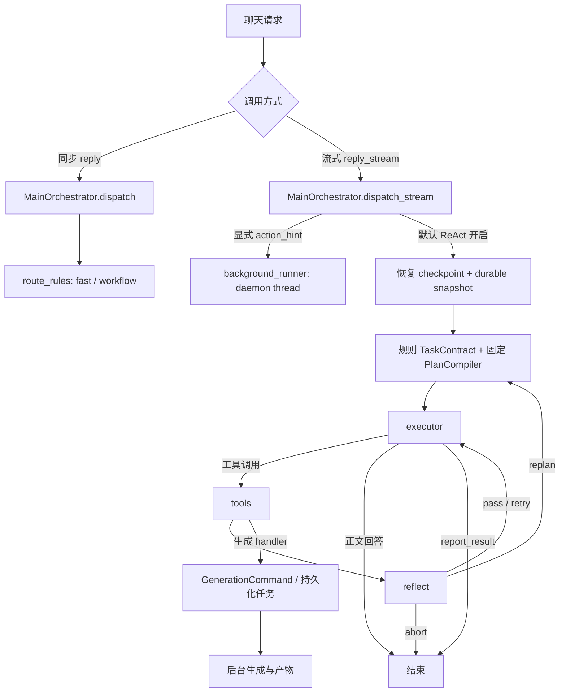

**Edu_AI Agent 架构、组织与规划执行审查报告**

审查日期：2026-09-07。审查版本：`1374eee03e065ccca52472fffae0aa0deb699cca`，工作目录 `/home/zxqs_ep/Edu_AI`，分支 `feat/frontend-update-20260907`。主要范围为教师/学生聊天 Agent、规划与工具执行、核验、状态恢复、生成任务衔接及其评测。课堂实时问答、博客内部生成和资源生成算法未做同等深度审查。本报告没有修改产品代码，也没有提交真实生成任务。

**审查结论**

当前系统有实际可用的组件，但尚未形成可靠的 Agent 执行闭环。如果产品目标是“理解自然表达，持续完成多步骤教学任务，并可靠恢复和核验结果”，本次审查判断：当前实现不达标。

最主要的问题是职责之间的契约没有执行到底：规则抽取决定了全部任务意图；固定模板声明了计划；执行器可以提前结束；反思只检查本轮工具结果；核验产生的修复指令没有接回调度；状态持久化保留了一部分字段，却没有恢复到上次执行位置。同一能力从不同入口进入，还会获得不同的执行和恢复语义。

这不能仅靠调整提示词或更换模型解决。应先修复任务身份、状态转换、完成判定和恢复机制，再增强语义规划。固定模板本身有助于控制工具权限，问题在于把不完整的关键词识别当成语义权威，又没有把模板变成真正可执行的状态机。

**证据与验证范围**

| 验证 | 本次结果 | 能说明什么 |
| --- | --- | --- |
| 6 个相关测试文件 | 62 passed，3.14 秒 | 现有局部断言通过，不代表跨节点闭环正确 |
| 仓库 80 条离线结构评测 | 71/80，通过率 88.75% | 当前抽取/编译行为与现有基准有 9 条不一致 |
| 隔离代码探针 | 复现下文 1–6 项中的关键行为 | 使用真实函数与替身工具，不依赖模型随机性或外部服务 |
| 静态调用链审查 | 完成 | 支持入口分叉、未消费字段、恢复与预算风险判断 |

离线评测只调用 `extract_task_contract → compile_plan → evaluate_case`，不运行真实 Agent 图、工具、后台任务或最终产物。其平均结构分 97.5% 和亚毫秒延迟不能解释为任务成功率、内容质量或用户响应时间。9 条不一致包含控制任务/对话绑定案例，部分可能需要更新历史测试定义；不能直接把全部 9 条都归为线上缺陷。不过博客意图识别失败已由独立探针复现。

证据文件：[探针源码](evidence/2026-09-07-agent-architecture/probes.py)、[探针输出](evidence/2026-09-07-agent-architecture/probes.txt)、[完整离线评测](evidence/2026-09-07-agent-architecture/offline-eval.json)。

**实际运行结构**



主链路证据：[MainOrchestrator](../../backend/src/app/chat/orchestrator/main_orchestrator.py:30)、[图构造](../../backend/src/app/chat/runtime/graph/builder.py:40)、[ReplyServiceV2](../../backend/src/app/chat/application/reply_service_v2.py:211)。图中的节点是单个 Agent 的执行阶段，并不是具有独立目标与协调协议的多 Agent 团队；现阶段也没有证据表明增加 Agent 数量能解决以下断点。

**1. P1：自然语言识别与参数抽取会直接改变用户任务，后续模型无法纠正**

已复现：

| 用户表达 | 当前结果 | 用户影响 |
| --- | --- | --- |
| 写一篇递归教学博客 | `intent=qa` | 不进入博客生成计划 |
| 请生成十道递归练习题，不要报告 | `resource_types=[quiz, report]` | 把否定对象当成需求，转入大纲确认 |
| 解释一下学生学习进度的定义 | `intent=status` | 概念解释被改为学习状态查询 |
| 生成十二道递归练习题，难度高，只要选择题 | `question_count=2`，没有难度和题型字段 | 题数错误；执行器使用默认难度/题型 |

根因：`_resource_types` 全句匹配资源名，不理解否定作用域；`_is_status_request` 优先匹配“进度”；生成动词词表漏掉“写一篇”；中文数词正则只取单个汉字；constraints 当前仅显式写入题数。强制工具参数从这个 contract 生成，因此这些遗漏不只是展示问题。

证据：[意图抽取](../../backend/src/app/chat/runtime/planning/task_contract_extractor.py:286)、[资源识别](../../backend/src/app/chat/runtime/planning/task_contract_extractor.py:384)、[题数解析](../../backend/src/app/chat/runtime/planning/task_contract_extractor.py:441)、[强制工具参数](../../backend/src/app/chat/runtime/nodes/executor.py:451)。

建议：语义抽取输出带证据的结构化草案，确定性校验器控制权限、范围、必需参数与否定约束。未知字段应保持 unknown 或澄清，不应静默变成默认值。新增否定、复合任务、中文数词、同义表达的对抗集。

**2. P1：问答正文输出后直接结束，计划中的核验和汇报没有执行**

编译器为 QA 声明 `answer_question → verify → report_result`，启用检索时前面再加 retrieval。但 executor 收到模型正文后直接发 `result`，返回普通 assistant 消息；`route_after_executor` 在没有 tool_calls 时直接进入 END。

探针在真实编译的 answer_question 步骤调用 executor，得到 `route=__end__`、零次 verify_task。带检索的 QA 正常推进到该节点后，同样走这个出口。前端显示的计划因此不能代表实际完成步骤。

证据：[QA 编译](../../backend/src/app/chat/runtime/planning/compiler.py:61)、[正文终止逻辑](../../backend/src/app/chat/runtime/nodes/executor.py:227)、[图路由](../../backend/src/app/chat/runtime/graph/routes.py:77)。

建议：正文先成为候选产物；节点完成后由调度器推进到核验。只有明确的 run 终态可以发最终 result。不要让“模型这轮没调工具”成为“整个任务完成”的判断。

**3. P1：核验失败不会驱动修复，仍可返回 agent.completed**

`handle_verify_task` 对 pass、fail、retry 都返回 `ok_result`。这可以表示“核验调用成功”，但当前反思层没有将业务核验结果解释成状态转换。最终汇报节点主要在产物 readback 分支读取失败原因，其他分支仍可输出 completed。

已复现：核验 `decision=fail`、修复指令 `retry_step`，工具仍 `ok=true`，最终事件仍为 `agent.completed`，正文为“已完成任务的工具调用与结构化审计”。源码检索显示 repair_directive 在 executor 中用于汇报文案，没有被调度执行。

另外，`verify_plan_execution` 把所有历史 `ok=false` 都算进 failed_tools。探针中同一工具先失败后成功、有来源证据，最终仍判 fail。核验没有按步骤/attempt 收敛到有效最终结果。

证据：[核验工具](../../backend/src/app/chat/runtime/agent_tools/handlers/verification.py:7)、[执行审计](../../backend/src/app/chat/runtime/verification/plan_verifier.py:75)、[最终汇报](../../backend/src/app/chat/runtime/nodes/executor.py:722)。

建议：分离 tool_transport_status、step_status 和 run_status；核验结果必须决定 pass、局部重试、部分成功、等待产物或失败。执行记录按 step_id/attempt_id 聚合，保留失败历史但允许后续成功解除阻塞。

**4. P1：失败缓存使重试失效**

`execute_tool` 在执行前查缓存，在执行后不区分成功失败就缓存。除了 image_search，其他工具均受此规则影响。

已复现一个“首次 transient_provider_error、再次应成功”的替身检索器：连续执行两次相同调用，底层只被调用一次，第二次仍返回首次失败，trace 也只有一次。这会消耗反思重试机会，却没有真正重试外部操作。

证据：[工具执行器](../../backend/src/app/chat/runtime/agent_tools/executor.py:32)、[缓存策略](../../backend/src/app/chat/runtime/agent_tools/tool_meta.py:80)、[反思重试](../../backend/src/app/chat/runtime/nodes/reflect.py:82)。

建议：可恢复失败不进入普通结果缓存，重试显式建立新 attempt；检索缓存与生成幂等分开建模。不要靠更换 query 绕过错误缓存。

**5. P1：旧大纲没有绑定任务，新请求可能跳过确认并携带旧内容**

compile_plan 对可确认资源主要判断 `active_outline` 是否存在，没有验证它属于当前主题、资源类型和修订。生成成功后 tools_node 也没有清除该大纲。持久化让这份旧大纲跨轮继续生效。

已复现：state 中是“链表报告大纲”，新请求是“生成递归教案”，contract 仍声明 `confirmation_policy=required`，计划却直接变成 `generate_resource → verify → report_result`。参数构造还会取 active_outline 的正文作为 confirmed_outline。

证据：[编译条件](../../backend/src/app/chat/runtime/planning/compiler.py:116)、[参数绑定](../../backend/src/app/chat/runtime/nodes/executor.py:451)、[跨轮大纲写回](../../backend/src/app/chat/runtime/nodes/tools.py:247)。

建议：大纲必须绑定 task_id、resource_type、topic、revision 和 approval；新任务不能复用旧任务的确认。执行完毕后归档旧任务，而不是用“是否有大纲”代表全局工作流状态。

**6. P1：计划模型声明的控制字段没有形成执行语义，质量检查开关也未接入新编译路径**

PlanStep 有 depends_on、success_predicate、max_attempts，Plan 有 max_replans；当前 runtime 对这些计划字段的引用主要停留在定义、序列化和写入。步骤推进由 `_maybe_advance_step` 在本次工具批次 pass 后直接 index+1，未检查声明的完成谓词。恢复预算使用另一组 global_constraints。

新 planner_node 直接 compile_plan 并 return，不再调用 `_attach_step_constraints`。后者负责设置 check_relevance、check_coherence、require_images，而相应 LLM/Vision reflector 需要这些开关才执行。新编译器没有为对应步骤补齐这些开关。因此“模型网关配置了”“反思器类存在”不等于这些语义质量检查在主路径激活。

证据：[当前规划入口](../../backend/src/app/chat/runtime/nodes/planner.py:14)、[遗留约束装配](../../backend/src/app/chat/runtime/nodes/planner.py:59)、[步骤推进](../../backend/src/app/chat/runtime/nodes/reflect.py:210)、[LLM 检查开关](../../backend/src/app/chat/runtime/reflection/llm_eval.py:22)、[视觉开关](../../backend/src/app/chat/runtime/reflection/vision.py:34)。

建议：明确哪些字段是执行契约，哪些只是展示；执行契约由一个调度器强制执行。为每个质量门增加实际激活断言，避免只测 helper 而漏测主入口。

**7. P1：同步、流式与显式操作入口的执行语义分叉**

dispatch 使用 route_rules，完全不经过 ReAct；dispatch_stream 默认进入 ReAct，但 action_hint 优先进入 background_runner。ReplyServiceV2 确实分别调用这两种方法，所以不是单纯的无调用旧函数。

ReAct 的 report/lesson_plan/quiz 等生成 handler 已接 GenerationCommand 和幂等键；action_hint 路径仍创建 daemon thread，保存的兼容任务不是同一套可租约恢复的生成命令。其线程与回调依赖进程生命周期，不能直接获得持久化 worker 的恢复保证。

证据：[入口分叉](../../backend/src/app/chat/orchestrator/main_orchestrator.py:30)、[线程提交](../../backend/src/app/chat/tasks/background_runner.py:259)、[持久化报告 handler](../../backend/src/app/chat/runtime/agent_tools/handlers/report.py:124)、[服务入口](../../backend/src/app/chat/application/reply_service_v2.py:211)。

建议：所有入口归一到同一个 TaskContract / Run / GenerationCommand 流程；同步与 SSE 只决定如何返回结果。将旧后台线程迁移到现有持久化任务设施，复用已有能力。

**8. P1：持久化保存了工作记忆，但不等于可恢复的 Agent run**

已有共享 MemorySaver 和 AgentRunStore，不能说“完全没有持久化”。不过：

- 每轮 initial_input 主动清空 current_plan、plan_step_index、retry_counts、verification_report；存储中有计划也不会继续执行到上次位置。
- durable snapshot 主要在 graph stream 结束或捕获 Exception 后保存，没有逐步持久化的 run/step 事件记录。
- 流式生成器关闭时的 GeneratorExit 不属于 Exception，也没有 finally 保证该次快照保存；这是断连时的代码风险，未做生产断连实测。
- checkpoint 与 durable state 合并采用字段覆盖，没有 revision/CAS；同会话并发读取、执行、写回未见串行锁或租约。AgentRunStore 的写入锁不能保护完整 read-modify-write 链路。
- workspace 之外的 checkpoint thread_id 只用 conversation_id；durable load 有 owner/course 校验，但内存读取本身没有同等校验。API 层是否能阻止构造跨范围请求需另做权限测试，不能据此直接认定已发生越权。

证据：[恢复与初始化](../../backend/src/app/chat/runtime/react_agent.py:79)、[每轮重置](../../backend/src/app/chat/runtime/react_agent.py:201)、[完成后持久化](../../backend/src/app/chat/runtime/react_agent.py:227)、[存储覆盖](../../backend/src/app/chat/persistence/agent_run_store.py:56)。

建议：为 Task、Run、Step、Attempt、Artifact 建立独立身份；执行位置、结果与事件逐步持久化。对同一 run 加版本控制或串行租约；恢复读取已完成步骤，而不是重新编译整轮。统一 owner/course/scope/thread 身份。

**9. P2：预算和降级没有覆盖整个执行过程**

默认 REACT_MAX_STEPS=6、REACT_TIMEOUT_SECONDS=40。max_steps 实际限制工具调用次数，不是规划步数或模型轮数。executor 在强制检索、强制计划调用之后才检查耗时；模型 stream 与工具执行内部也没有由此预算传递的统一 deadline。因此 40 秒不能视为端到端硬上限。并行工具共享 step_count，预算预留不是原子操作，此处是静态并发风险。

遇到 Agent 异常会切到 FastChatRuntime。它接收原 request/snapshot，未获得当前 graph 工具结果与 pending task 状态；trace 合并只发生在最终返回。已经做过工作后再退回直接回答，容易丢失已完成工作上下文，部分配置下还会重新检索。

证据：[预算位置](../../backend/src/app/chat/runtime/nodes/executor.py:55)、[模型流](../../backend/src/app/chat/runtime/nodes/executor.py:176)、[降级](../../backend/src/app/chat/runtime/react_agent.py:354)、[并行工具](../../backend/src/app/chat/runtime/nodes/tools.py:324)、[默认配置](../../backend/src/core/config.py:231)。

建议：区分 wall time、工具次数、LLM 轮次、token/cost 和每步 attempts；调用前预留预算并传递 deadline。降级应是保留已完成结果的结构化失败/部分成功状态。

**10. P2：组织层残留与评测范围使系统容易“看起来完整”**

planner.py 共 622 行，而实际 planner_node 在前 56 行完成规则编译；后面仍保留 _call_planner_llm、旧 fallback plan、约束修补等逻辑。不能把整段都删除：例如 tools_node 仍导入其中的视觉关键词 helper。executor.py 为 1210 行，集中承担工具策略、参数构造、检索强制、输出保护、计划提示和终态文案，职责耦合明显。

route_chat_service 与 reply_service_v2 分别构建运行时，注入能力不同；service.py 还保留另一套 supervisor 图。后者本次未证明是默认活跃入口，应按调用证据清理，不能只按文件名统计成多个活跃 Agent。

评测主要验证合同和模板，缺少“用户话语→实际工具→后台产物→核验→终态”的一致性门槛。本次 62 项测试全过而闭环探针失败，正说明局部测试与产品目标存在落差。

建议：将语义理解、计划编译、调度、工具适配、证据核验和事件投影分离；保留一个运行时装配入口。删除无调用规划实现、迁出仍在使用的 helper，并建立跨入口一致性测试。

**值得保留的基础**

1. TaskContract 和 capability/role 工具边界有价值，能限制模型随意调用工具。
2. GenerationCommand、持久化 worker、任务租约与生成幂等能力已经存在，迁移旧入口比另建任务平台更合理。
3. 验证模型已经区分执行、证据、产物、人格，并表达 repair_directive；主要工作是接通调度与状态语义。
4. AgentRunStore、工作记忆、长期记忆与现有测试提供了演进基础；应统一身份和来源，不宜无差别推倒重写。

**建议的目标组织**

`请求归一化 → 语义理解 → Contract 校验 → Plan 编译 → 持久化 Step 调度 → 工具/生成命令 → Evidence/Artifact 核验 → Run 终态 → UI 投影`

规划器负责“做什么、依赖什么、怎样算完成”；调度器负责“下一步、预算、重试与恢复”；工具只返回执行事实；核验器决定哪些事实满足目标；UI 展示服务端确认的状态。模型可以提出计划与修复建议，但不能自行宣布系统已经执行或完成。

任务状态至少区分 running、awaiting_user、awaiting_artifact、succeeded、partially_succeeded、failed、canceled。生成任务被接受仅代表 submitted；生成成功且产物可读、必要质量检查通过，才代表任务完成。

**整改顺序与验收门槛**

| 顺序 | 工作 | 必须看到的验收结果 |
| --- | --- | --- |
| 第一阶段：修复正确性 | QA 终止门、核验结果驱动状态、失败缓存、旧大纲绑定、已复现解析错误 | verify=fail 不再 completed；暂时失败确实再调用一次；新主题不能复用旧确认；十二道得到 12 |
| 第二阶段：统一执行 | 合并入口语义，旧线程接持久化队列，Step/Attempt 和统一 deadline | 同一请求同步/流式/action_hint 的合同与工具边界一致；重启不丢已提交任务 |
| 第三阶段：恢复闭环 | 持久化步骤、版本控制、断连重连、局部修复与产物回读 | 在检索后、提交后、核验前故障均能恢复；不重复生成；并发修改无静默覆盖 |
| 第四阶段：改善理解与质量 | 语义抽取、否定/约束解析、激活质量门、调整研究覆盖判定 | 改写/否定/复合需求都满足约束；质量门确实运行且影响最终判定 |
| 持续工作 | 端到端评测与失败分类 | 分别记录理解正确率、工具执行成功率、产物通过率、误报完成率、重复提交率、恢复成功率及真实延迟 |

第一阶段应优先于新增 Agent 角色、更多反思提示词或更复杂的规划图。对上述确定性缺陷，验收应要求探针全部通过；对真实模型质量，应先采集实际教学任务建立基线，再协商目标值，不应凭空设成功率。

**复验方法与限制**

本次测试命令（从 backend/src 执行；临时 AgentRunStore，不使用生产任务库）：

```bash
APP_STATE_PERSISTENCE_MODE=json AGENT_RUNS_DB_PATH=/tmp/edu-agent-audit-20260907-runs.db \
/home/zxqs_ep/miniforge3/envs/edu-ai/bin/python -m pytest \
tests/chat/runtime/test_plan_compiler.py \
tests/chat/runtime/test_teaching_task_contract.py \
tests/chat/runtime/test_verification_report.py \
tests/chat/runtime/test_generation_idempotency.py \
tests/chat/runtime/test_react_agent.py \
tests/chat/runtime/test_reflect_rules.py -q

/home/zxqs_ep/miniforge3/envs/edu-ai/bin/python scripts/eval_teacher_agent.py \
--json-out /tmp/edu-agent-offline-audit.json
```

探针从仓库根目录执行，`PYTHONPATH=backend/src`，运行 evidence 目录的 probes.py。探针只展示实际行为，不是“修复后预期通过”的产品回归测试。本次没有调用真实 LLM、没有创建真实资源、没有压力测试或线上日志抽样，因此不提供生产成功率、费用或延迟估计。报告中恢复、并发和身份隔离问题是代码风险，需要专门故障注入和权限测试进一步定量验证。
