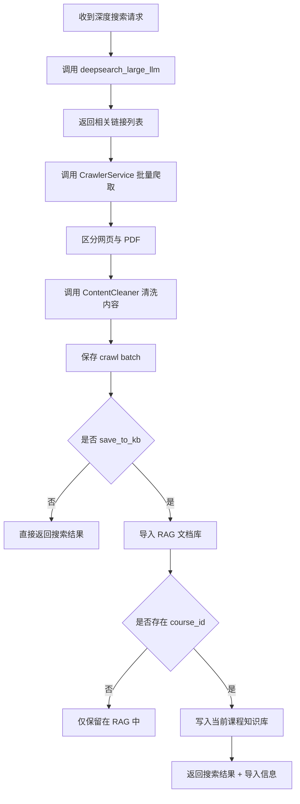
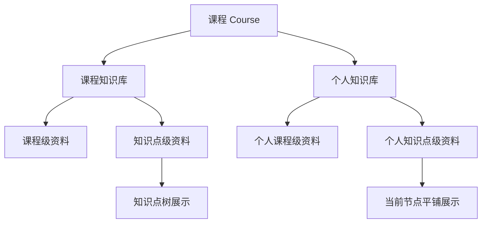
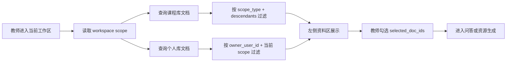
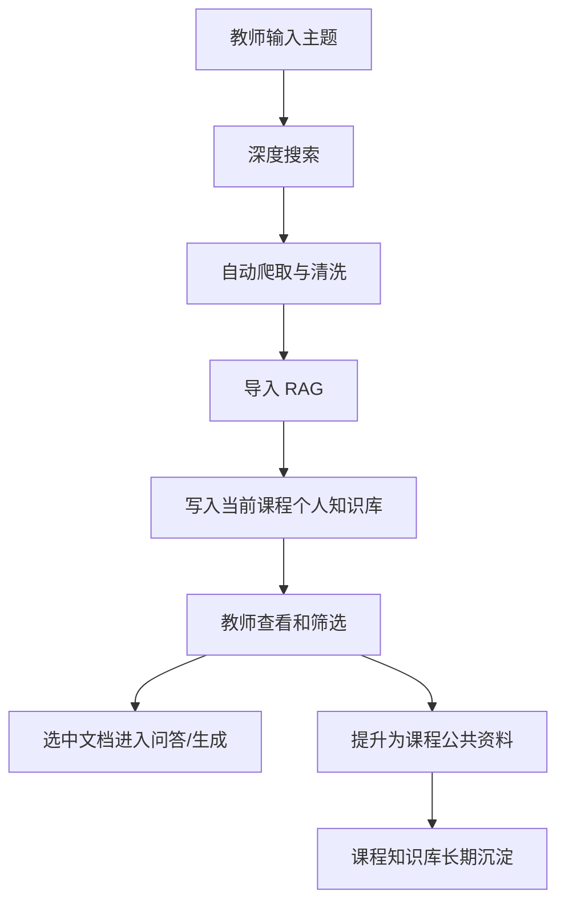

# 深度搜索模块与多层知识库功能技术文档

## 1. 模块概述

本项目围绕教师备课与课程资源建设场景，构建了“外部信息采集 + 本地知识沉淀 + 分层知识管理 + 智能问答/生成复用”的完整链路。其中，深度搜索模块和多层知识库模块是整个系统的知识入口和知识底座。

深度搜索模块负责把互联网中的相关网页、PDF 和图像资源快速转化为系统可用的教学资料；多层知识库模块负责将这些资料按照课程、知识点、教师个人积累等不同维度进行组织、存储、检索和复用。

从系统定位上看：

- 深度搜索模块解决“到哪里找资料、怎样高效采集资料”的问题。
- 多层知识库模块解决“找到的资料如何归档、如何按课程与知识点组织、如何服务问答与生成”的问题。

二者共同构成项目中“从外部资源到内部知识资产”的关键闭环。

## 2. 建设目标

本模块设计的总体目标包括以下几个方面：

| 建设目标 | 说明 |
| --- | --- |
| 支持主题驱动的深度搜索 | 教师输入关键词或主题后，系统自动规划搜索并获取高相关链接 |
| 支持自动化爬取与内容清洗 | 自动抓取网页/PDF 内容，并转换为适合入库和后续检索的文本 |
| 支持搜索结果直接沉淀知识库 | 搜索得到的网页资料不仅展示给教师，还可直接纳入本地知识体系 |
| 支持课程级与知识点级资料组织 | 资料可归属到整门课程，也可精确归属到具体知识点 |
| 支持课程库与个人库双层并行 | 同时满足课程公共资料沉淀和教师个性化备课需要 |
| 支持后续问答与资源生成复用 | 所有入库资料都能继续服务于问答、报告、教案、习题、PPT 等生成任务 |

## 3. 整体架构

深度搜索模块与多层知识库模块并不是孤立存在，而是通过统一的数据流连接。


从技术层面，这条链路涉及四个核心部分：

- 搜索规划：借助 LLM 将教师主题分解为可执行检索任务。
- 内容获取：调用 EduAgent 与自动化爬虫进行网页/PDF 抓取。
- 内容沉淀：将抓取结果转换为 RAG 文档，并按课程/知识点/知识库类型持久化。
- 内容复用：在问答、生成和工作台中作为可选资料继续使用。

## 4. 深度搜索模块

## 4.1 模块定位

深度搜索模块的目标不是仅返回若干搜索引擎结果链接，而是要尽可能完成一条“可直接用于教学”的资料采集链路：

1. 根据教师输入的主题进行深度搜索。
2. 自动筛出若干相关网页或 PDF 链接。
3. 自动抓取页面正文或下载 PDF。
4. 清洗噪声信息，提取核心内容。
5. 将结果以资料形式返回给前端。
6. 可选地自动导入 RAG 和课程知识库。

因此，它是一个“搜索 + 爬取 + 清洗 + 入库”的组合能力，而不是单一搜索接口。

## 4.2 用户可见功能

从教师视角，深度搜索提供的功能包括：

- 输入一个主题或关键词，系统自动执行深度搜索。
- 查看系统找到的相关链接。
- 查看每个链接抓取到的正文摘要。
- 对爬取成功和失败的结果进行区分展示。
- 将搜索结果自动沉淀到知识库中。
- 后续直接在问答和生成中使用这些资料。

在界面上，深度搜索有两种主要入口：

- 独立的 `DeepSearchPage` 页面，适合集中式资料采集。
- `SourcePanel` 左侧资料区中的“深度研究”入口，适合边查边沉淀到当前课程工作区。

## 4.3 前端交互设计

### 4.3.1 独立深度搜索页面

独立页面主要面向“明确地想针对某个主题做资料搜集”的场景。教师输入检索主题后，系统返回：

- 当前查询内容
- 搜索批次 ID
- 成功抓取数量和失败数量
- 搜索到的链接列表
- 每个页面的正文摘要或错误信息

这一页面适合项目演示“外部资料采集能力”。

### 4.3.2 工作台资料区深度研究入口

在教师 AI 工作台左侧资料区中，输入搜索主题后，可以直接在当前课程或知识点工作区内进行深度研究。相比独立页面，这一入口更强调“采集后直接纳入当前工作区”。

这一设计有两个优势：

- 教师不需要离开当前课程上下文。
- 搜索结果可以直接和当前课程、当前知识点绑定，形成后续问答和生成的依据。

> 插图建议：此处建议放两张截图，一张是独立深度搜索页面，一张是工作台左侧“深度研究”弹窗或搜索框截图。

## 4.4 深度搜索后端流程

深度搜索后端入口为 `/agent/deepsearch-and-crawl`。请求中包含：

| 参数 | 说明 |
| --- | --- |
| `query` | 搜索主题或关键词 |
| `max_urls` | 最多抓取的链接数量 |
| `crawl_timeout` | 单个链接抓取超时时间 |
| `save_to_kb` | 是否自动导入知识库与 RAG |
| `course_id` | 当前课程 ID |
| `scope_type` | 当前工作区范围 |
| `scope_id` | 当前知识点 ID |

完整流程如下：



## 4.5 搜索规划能力

搜索规划由 EduAgent 中的 `deepsearch_large_llm` 提供。它并不是直接调用通用搜索引擎，而是先通过 Agent 机制将教师的主题拆解为若干子查询，再调用网页搜索工具和页面扫描工具，最终返回一组相关链接。

这一阶段的主要特点是：

- 搜索由大模型驱动，而不是固定关键词匹配。
- Agent 可以根据主题自动调整查询表达。
- 搜索目标是“尽快获得足够多的相关链接”，而不是无限扩展搜索范围。
- 输出被限制为结构化 JSON 链接列表，便于后续程序化处理。

因此，这一模块更接近“智能检索规划器”，能够提升搜索结果与教学主题的贴合度。

## 4.6 自动化爬取机制

获得候选链接后，系统通过 `CrawlerService` 进行批量爬取。该服务底层接入自动化爬虫模块，对网页和 PDF 采用不同处理方式：

- 对网页，抓取正文文本并尝试提取图片、站点图标等辅助信息。
- 对 PDF，下载文件本体，为后续文本提取和知识库存储做准备。

爬取阶段的核心能力包括：

- 支持批量 URL 输入。
- 支持限定最多抓取数量。
- 支持失败结果回收和错误信息记录。
- 支持将每个抓取结果转换为统一结构。

返回的每个结果包含：

| 字段 | 说明 |
| --- | --- |
| `url` | 原始链接 |
| `title` | 页面或文件标题 |
| `content` | 抓取到的正文内容 |
| `content_type` | 内容类型，如 `text` 或 `pdf` |
| `status` | 成功或失败 |
| `error_message` | 错误原因 |
| `metadata` | 附加元数据，如图片、图标等 |
| `file_path` | 本地抓取文件路径 |

## 4.7 内容清洗机制

抓取结果并不能直接用于知识库和问答，因此系统会调用 `ContentCleaner` 进行清洗。

网页文本清洗主要包括：

- 统一换行与空白。
- 去除异常控制字符。
- 保留段落结构。
- 提取可能的标题和日期等元信息。
- 在必要时转换为更适合展示和后续处理的 Markdown 形式。

PDF 清洗主要包括：

- 使用 MinerU 导入管线提取 PDF 文本。
- 保留页码信息。
- 清理格式噪声。
- 提取 PDF 元信息，如标题、作者、创建时间。

清洗后的结果统一输出为：

- `cleaned_content`
- `markdown_content`
- `metadata`
- `word_count`
- `char_count`

这一阶段的作用，是把“面向爬虫的原始内容”转化为“面向知识库和大模型的可读内容”。

## 4.8 批次存储与结果回查

深度搜索结果不是一次性返回后即丢弃，而是按批次保存。

系统会为每次搜索生成 `batch_id`，并保存：

- 批次元数据：查询词、总链接数、成功数、失败数、创建时间。
- 每个抓取结果的摘要信息。
- 正文较长时，将完整内容单独保存为文件。

这样做的好处包括：

- 支持前端刷新查看结果。
- 支持查询历史。
- 便于对搜索过程进行追踪和演示。
- 为后续资料管理提供可回溯入口。

相关接口包括：

- `/agent/crawl-results/{batch_id}`：查看某次批次结果
- `/agent/crawl-history`：查看历史搜索批次

## 4.9 深度搜索结果导入 RAG

若 `save_to_kb=true`，系统会将抓取结果进一步导入 RAG。

导入逻辑包括：

- 为每个网页或 PDF 生成标准化本地文件。
- 网页内容转为 Markdown 文档保存。
- PDF 则尽量保留原始文件。
- 将生成后的文档导入 RAG 索引。
- 为文档补充 `source_url`、`source_title`、`source_domain`、`summary`、`summary_title` 等元信息。

如果抓取结果中包含页面图片或站点图标，系统还会：

- 将这些图像作为隐藏的辅助图像资源导入。
- 在文档记录中建立图片关联。
- 为前端列表展示提供图标和更好的可读标题。

因此，深度搜索模块不仅把网页“抓下来”，还把网页“转成了系统内可检索、可引用、可展示的标准文档”。

## 4.10 深度搜索导入当前课程知识库

当请求中带有 `course_id` 时，系统会进一步将导入 RAG 的文档同步到当前课程知识库中。

这里的设计非常重要：

- 深度搜索得到的文档，默认进入当前课程的知识库体系。
- 文档会继承当前工作区的 `scope_type` 和 `scope_id`。
- 文档会默认进入教师个人库，而不是直接进入课程公共库。

这一设计体现了“先个人沉淀，再选择性推广”的原则：

- 防止网络资料未经筛选直接污染课程公共知识库。
- 允许教师先在个人库中检查、筛选、再决定是否提升为课程资料。

## 5. 多层知识库模块

## 5.1 模块定位

多层知识库模块负责对系统中的所有教学资料进行分层组织、持久化存储和范围化检索。它的目标不是简单存文件，而是让每份资料都具备明确的归属关系和使用边界。

这里的“多层”体现在两个维度：

### 维度一：知识库类型分层

- 课程知识库 `course`
- 个人知识库 `personal`

### 维度二：工作区范围分层

- 课程级 `course`
- 知识点级 `knowledge_point`

因此，实际知识库结构是二维组合：

| 知识库类型 | 范围类型 | 含义 |
| --- | --- | --- |
| 课程库 + 课程级 | 整门课程的公共资料 |
| 课程库 + 知识点级 | 某个知识点挂接的课程公共资料 |
| 个人库 + 课程级 | 教师在该课程下的个人总资料 |
| 个人库 + 知识点级 | 教师在某个知识点下的个人备课资料 |

## 5.2 设计目标

多层知识库模块的设计目标包括：

- 支持课程公共资料和教师个人资料分离。
- 支持课程级和知识点级双层组织。
- 支持从教师工作台直接查看当前工作区资料。
- 支持父节点和子节点之间的范围聚合。
- 支持资料上传、删除、从 RAG 导入和后续提升为课程资料。
- 支持问答和生成模块基于当前范围精确选取资料。

## 5.3 知识库总体结构



### 设计逻辑说明

- 课程知识库强调“共享”和“结构化”，更适合按知识点树展示。
- 个人知识库强调“私有”和“灵活”，更适合按当前工作区平铺展示。
- 对课程库而言，父知识点可以聚合子知识点资料。
- 对个人库而言，默认不聚合子知识点资料，避免不同知识点个人材料互相干扰。

## 5.4 存储结构设计

课程资料由 `CourseStorageManager` 统一管理。每门课程都有独立目录。

```text
course_data/
  courses/
    {course_id}/
      course_info.json
      metadata.json
      knowledge_graph.json
      knowledge_base/
        documents/
        index.json
      generated_materials/
        reports/
        lesson_plans/
        quizzes/
        ppts/
        videos/
```

其中：

- `documents/` 存放知识库文件实体。
- `index.json` 存放知识库索引，是知识库逻辑组织的核心。
- `generated_materials/` 存放后续报告、教案、PPT 等生成产物。

## 5.5 知识库索引字段设计

每条知识库记录至少包含如下字段：

| 字段 | 说明 |
| --- | --- |
| `id` | 文档唯一标识 |
| `filename` | 文件显示名称 |
| `path` | 相对课程目录的存储路径 |
| `size` | 文件大小 |
| `uploaded_at` | 上传时间 |
| `course_id` | 所属课程 |
| `scope_type` | 课程级或知识点级 |
| `scope_id` | 知识点 ID，课程级为空 |
| `library_type` | `course` 或 `personal` |
| `owner_user_id` | 个人资料所属教师 |
| `promoted_from_document_id` | 若由个人资料提升为课程资料，则记录来源 |

这一设计使系统可以同时回答如下问题：

- 这份资料属于哪门课程？
- 这份资料属于整个课程还是某个知识点？
- 这份资料是课程公共资料还是教师个人资料？
- 如果是个人资料推广而来，它原本来自哪里？

## 5.6 工作区范围设计

系统工作区分为：

- 课程级工作区
- 知识点级工作区

前端通过 `workspaceScope` 在 URL 与 API 参数之间维护范围信息：

- `scopeType=course` 表示课程总目录工作区
- `scopeType=knowledge_point` 表示某个知识点工作区

对应的 API 查询参数中，还会使用：

- `aggregate=true`：在课程级视图下允许聚合结果
- `include_descendants=true`：在知识点查询时允许包含子节点资料

## 5.7 课程库与个人库展示策略

在教师工作台左侧 `SourcePanel` 中，课程库与个人库采用不同展示策略。

### 课程知识库展示策略

- 当工作区是课程级时，课程库支持聚合展示整门课程相关资料。
- 当工作区是知识点级时，课程库支持显示当前知识点以及子知识点资料。
- 非叶子节点时，课程库适合树形展示，体现知识图谱层级。

### 个人知识库展示策略

- 只显示当前教师自己的资料。
- 默认只展示当前工作区直接归属的个人资料。
- 不自动聚合子知识点个人资料。

这样设计的原因是：

- 课程库强调课程建设与共享，适合聚合。
- 个人库强调教师个人探索与临时沉淀，不适合跨节点扩散。

## 5.8 检索规则

知识库查询主要受四类条件影响：

- `course_id`
- `scope_type`
- `scope_id`
- `library_type`

同时还受两个开关影响：

- `aggregate`
- `include_descendants`

检索规则可概括为：

| 场景 | 课程库 | 个人库 |
| --- | --- | --- |
| 课程级工作区 | 可聚合课程级与子范围资料 | 只显示教师自己的课程级个人资料 |
| 知识点级叶子节点 | 显示该节点课程资料 | 显示该节点个人资料 |
| 知识点级非叶子节点 | 可包含该节点及后代节点课程资料 | 默认只显示当前节点直接个人资料 |

这一规则能在“查得全”和“查得准”之间保持平衡。

## 5.9 多层知识库查询流程



## 5.10 文档上传与导入方式

多层知识库支持三种主要资料进入方式：

### 方式一：直接上传文件

教师可上传 PDF、Word、Markdown、图片、视频等资料到当前课程知识库或个人知识库中。

### 方式二：从 RAG 导入

如果某份资料已经在 RAG 中存在，则可直接通过“从 RAG 加入课程知识库”方式引入，而无需重复上传。

### 方式三：由深度搜索结果导入

深度搜索结果在导入 RAG 后，可进一步自动写入当前课程工作区下的个人知识库。

因此，多层知识库不是独立录入体系，而是系统各种资料入口的统一汇聚点。

## 5.11 个人资料提升为课程资料

项目中一个很有价值的设计是：个人资料可以被“推广”到课程知识库。

其逻辑是：

- 深度搜索或个人上传得到的资料，先进入教师个人库。
- 教师确认资料有价值后，再将其加入课程知识库。
- 加入课程知识库时，记录来源 `promoted_from_document_id`。

这一机制非常适合教学场景：

- 教师可以先自由探索，不影响课程公共知识体系。
- 当探索结果被验证有价值后，再沉淀为正式课程资料。
- 有助于课程资源逐步积累，而不是一次性硬性建设。

## 6. 深度搜索与多层知识库的联动闭环

深度搜索模块和多层知识库模块最重要的价值，不在于各自单点能力，而在于二者形成了闭环。



这一闭环的意义在于：

- 外部网络资料不再只是一次性搜索结果。
- 搜索结果会变成可持续使用的课程资产。
- 教师可以在“个人探索”与“课程沉淀”之间逐步过渡。
- 知识库建设由静态录入转为动态增长。

## 7. 关键接口清单

## 7.1 深度搜索相关接口

| 接口 | 方法 | 说明 |
| --- | --- | --- |
| `/agent/deepsearch-and-crawl` | POST | 深度搜索并批量爬取 |
| `/agent/crawl-results/{batch_id}` | GET | 获取某次搜索的详细结果 |
| `/agent/crawl-history` | GET | 获取历史搜索记录 |

## 7.2 知识库相关接口

| 接口 | 方法 | 说明 |
| --- | --- | --- |
| `/api/courses/{course_id}/knowledge-base/documents` | GET | 获取课程知识库或个人知识库文档 |
| `/api/courses/{course_id}/knowledge-base/documents` | POST | 上传文件到知识库 |
| `/api/courses/{course_id}/knowledge-base/documents/add-from-rag` | POST | 从 RAG 文档导入知识库 |
| `/api/courses/{course_id}/knowledge-base/documents/{document_id}` | DELETE | 删除知识库文档 |

## 8. 典型应用场景

### 场景一：围绕某个知识点快速补充网络资料

教师进入“二叉树遍历”知识点工作区，输入“二叉树遍历 课堂案例 图解”。系统执行深度搜索，抓取若干网页内容，并自动导入当前知识点下的个人知识库。教师随后勾选这些资料，直接生成课堂讲解提纲或习题。

### 场景二：先探索，再沉淀

教师在个人库中通过深度搜索得到若干高质量资料，确认适合作为正式课程资源后，再将其加入课程知识库。这样可以避免网络噪声直接污染课程正式资料体系。

### 场景三：课程级整体资料建设

教师在课程总目录下执行深度搜索，搜集课程大纲、课程案例、行业规范等资料。这些资料以课程级个人库或课程库形式沉淀，可服务整门课的问答与资源生成。

## 9. 模块价值与创新点

### 9.1 深度搜索模块价值

- 将互联网搜索从“人工点链接”升级为“自动采集并入库”。
- 将分散网页转化为可持续使用的教学资料。
- 降低教师手动找资料、复制资料、整理资料的成本。

### 9.2 多层知识库模块价值

- 支持课程公共资料和个人资料并行管理。
- 支持课程级和知识点级双层组织。
- 支持从“临时探索”到“正式沉淀”的演化过程。
- 为问答、生成和图谱工作区提供稳定知识底座。

### 9.3 联动创新点

- 深度搜索结果可直接沉淀到当前工作区，而不是停留在搜索页。
- 搜索结果先进入个人库，再由教师决定是否推广到课程库，兼顾灵活性与规范性。
- 多层知识库与知识点工作区绑定，使知识组织更加贴合真实课程结构。

## 10. 总结

深度搜索模块解决了“如何从外部世界高效获得资料”的问题，多层知识库模块解决了“如何把获得的资料组织成课程资产”的问题。二者配合后，系统形成了从搜索、爬取、清洗、入库、展示到复用的完整知识建设链路。

这意味着项目不再依赖教师手工维护一套静态知识库，而是具备了动态扩充和持续演化能力。对教师而言，这既提升了备课效率，也提升了知识沉淀的质量；对系统而言，这为后续问答、报告、教案、PPT 和教学视频生成提供了更强、更真实、更持续增长的知识基础。

## 11. 建议插图

| 图片编号 | 建议内容 | 用途 |
| --- | --- | --- |
| 图 1 | 深度搜索页面截图 | 展示主题输入、批次结果、链接列表与抓取结果 |
| 图 2 | 工作台左侧“深度研究”入口截图 | 展示教师在当前课程/知识点内直接发起搜索 |
| 图 3 | 深度搜索流程图 | 展示搜索、爬取、清洗、入库完整链路 |
| 图 4 | 多层知识库结构图 | 展示课程库/个人库、课程级/知识点级双层关系 |
| 图 5 | 资料区截图 | 展示课程知识库与个人知识库并列显示效果 |
| 图 6 | 搜索结果入库后的资料勾选截图 | 展示搜索结果如何进入问答和生成 |
