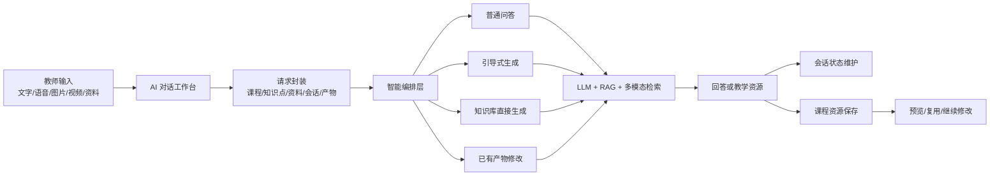
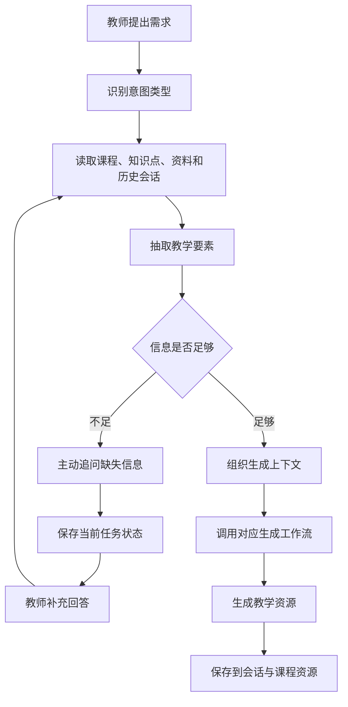
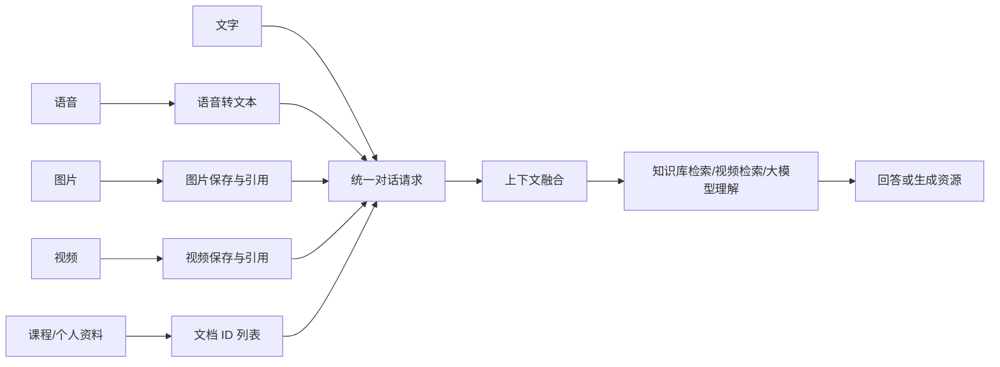
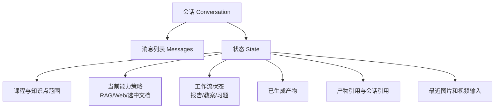
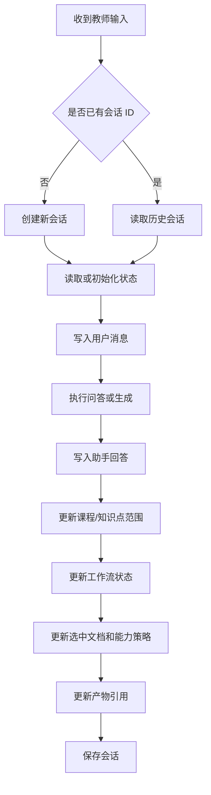
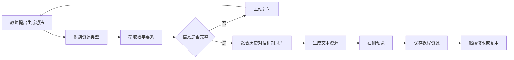
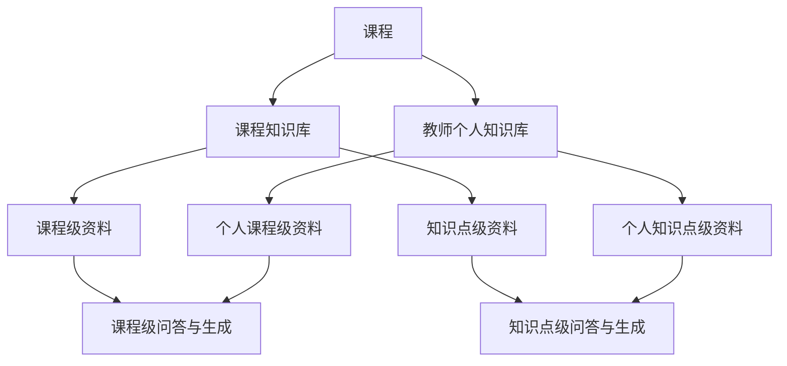
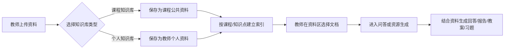

# 多模态 AI 互动式教学智能体技术文档

## 胜文负责模块：智能对话、上下文维护、文本资源生成与双知识库结构

## 1. 模块概述

本模块面向教师备课与教学资源生产场景，负责系统中的智能对话入口、教师意图理解、对话上下文维护、文本类教学资源生成，以及课程知识库与教师个人知识库的协同使用。

在整个项目中，本模块承担“教师教学思路进入系统后的核心调度层”作用。教师可以通过文字、语音、图片、视频、课程资料等方式表达教学需求，系统会结合当前课程、知识点、选中资料、历史对话和已有生成产物，完成多轮澄清、知识融合、内容生成和结果迭代。

本模块重点解决传统 AI 教学工具中常见的三个问题：

- 只支持单轮指令，无法持续理解教师复杂教学思路。
- 资料、对话和生成结果割裂，难以形成连续工作流。
- 生成资源缺少课程知识支撑，结果容易泛化，难以直接用于教学。

通过本模块，系统形成了从“教师提出想法”到“AI 澄清需求”，再到“融合课程资料生成教学资源”，最后到“保存并继续修改”的闭环。

## 2. 建设目标

本模块的建设目标包括以下五个方面：

| 建设目标 | 说明 |
| --- | --- |
| 支持引导式对话 | 系统能够识别教师意图，主动追问缺失信息，帮助教师明确教学目标、知识点、对象、时长和资源形式 |
| 支持多模态对话 | 支持文字、语音、图片、视频和知识库资料共同参与问答与生成 |
| 支持对话状态维护 | 保存会话历史、工作区范围、任务状态、选中文档、生成产物和引用关系 |
| 支持文本资源生成 | 生成报告、教案、习题等文本类教学资源，并支持对话式生成和知识库直接生成两条链路 |
| 支持双知识库结构 | 通过课程知识库和个人知识库区分公共资料与教师私有资料，并支持课程级和知识点级组织 |

## 3. 赛题要求对应关系

本模块主要对应赛题“多模态 AI 互动式教学智能体”中的多模态输入、智能对话、知识融合和教学资源生成要求。

| 赛题要求 | 本模块实现 |
| --- | --- |
| 支持语音输入和文字输入，允许教师阐述教学思路 | 聊天面板支持文本输入和语音转文本输入，教师可自然表达备课需求 |
| 能主动发起提问以澄清模糊需求 | 针对报告、教案、习题等任务设计槽位抽取和完整性判断机制，信息不足时主动追问 |
| 支持多轮对话，并能总结确认最终需求 | 会话中保存工作流状态、已填信息、缺失信息和当前任务，支持多轮补全 |
| 支持上传 PDF、Word、PPT、图片、视频等参考资料 | 支持课程资料选择、图片上传、视频上传，并将资料引用加入当前对话请求 |
| 理解教师输入和对话历史，结构化提取教学要素 | 通过上下文组织器提取课题、对象、目标、重点难点、题型、题量等教学要素 |
| 将教师意图、参考资料、本地知识库进行融合 | 通过课程知识库、个人知识库、选中文档和 RAG 检索结果共同构造生成上下文 |
| 生成 Word 教案、结构化教学文本资源 | 已实现教案、报告、习题等文本资源生成，生成结果进入课程资源中心 |
| 支持迭代优化 | 通过产物引用和会话引用维护已有结果，教师可继续提出修改意见 |

> 插图建议：此处可放一张“赛题要求与项目功能对应表”截图或图示，突出本模块对赛题核心指标的覆盖。

## 4. 模块总体方案

本模块采用“前端统一交互入口 + 后端智能编排 + 会话状态持久化 + 知识库融合生成”的设计。

教师所有输入首先进入 AI 对话工作台。系统根据输入内容判断任务类型，如果是普通问题，则直接进入问答流程；如果是教学资源生成需求，则进入对应生成工作流；如果教师引用了已有产物，则进入产物修改或继续优化流程。

该方案的关键特点是：

- 输入统一：不同模态输入最终都汇聚到统一的对话请求中。
- 上下文统一：课程、知识点、资料、历史对话和产物引用共同构成上下文。
- 生成统一：报告、教案、习题等资源都以结构化产物形式返回。
- 存储统一：会话历史和生成资源均可持久化，支持后续继续使用。

## 5. 引导式智能对话

### 5.1 功能说明

引导式智能对话是本模块的核心功能之一。其目标不是让教师一次性写出完整指令，而是让教师可以像与助教沟通一样逐步表达想法，由系统主动识别缺失信息并进行补问。

教师可以输入如下自然语言需求：

- “帮我生成一份关于二叉树遍历的教案。”
- “根据这些资料出一套课堂练习题。”
- “围绕这个知识点整理一份教学分析报告。”
- “把刚才生成的内容再简化一点，适合 20 分钟课堂讲解。”

系统会根据需求类型自动判断后续动作：

- 如果需求明确，直接生成资源。
- 如果需求不完整，主动追问缺失信息。
- 如果需求是在修改已有产物，定位当前产物并进行迭代。
- 如果需求只是普通问答，则结合知识库或网络信息回答。

### 5.2 引导式对话流程

### 5.3 教学要素抽取

系统会根据不同任务抽取不同的教学要素。

报告类任务重点抽取：

| 要素 | 示例 |
| --- | --- |
| 报告主题 | 二叉树遍历方法分析 |
| 分析重点 | 前序、中序、后序遍历的差异 |
| 使用资料 | 当前选中的课程讲义、网页资料或个人资料 |
| 输出风格 | 简明综述、详细分析、教学建议 |

教案类任务重点抽取：

| 要素 | 示例 |
| --- | --- |
| 课题 | 二叉树遍历 |
| 授课对象 | 大一计算机专业学生 |
| 课时长度 | 45 分钟 |
| 教学目标 | 理解三种遍历方式并能手动推导 |
| 重点难点 | 递归过程、遍历序列转换 |
| 教学活动 | 案例引入、图示讲解、课堂练习 |

习题类任务重点抽取：

| 要素 | 示例 |
| --- | --- |
| 考查主题 | 二叉树遍历 |
| 题量 | 5 道 |
| 题型 | 选择题、判断题、简答题 |
| 难度 | 中等 |
| 是否包含答案 | 是 |
| 是否包含解析 | 是 |

通过这些结构化要素，系统能够将教师模糊的自然语言转换为可执行的生成指令。

### 5.4 主动追问机制

当系统判断信息不足时，会进入追问阶段。例如：

| 教师输入 | 系统追问 |
| --- | --- |
| “帮我生成一份教案。” | “请补充本节课的主题、授课对象和预计课时。” |
| “帮我出几道题。” | “请说明题目主题、题型、题量和难度要求。” |
| “生成一份报告。” | “请说明报告主题，以及希望偏向知识总结、教学分析还是学习建议。” |

主动追问的价值在于避免 AI 直接生成泛化内容。系统通过多轮补全，把教师的隐性教学意图显式化，再进入生成阶段。

> 插图建议：此处建议放一张真实聊天截图，展示“教师输入模糊需求，系统主动追问，教师补充后继续生成”的过程。

## 6. 多模态对话能力

### 6.1 功能说明

多模态对话能力用于支持教师以更自然的方式提供教学意图和参考资料。教师不需要把所有信息都手动整理成文字，可以直接上传资料、粘贴图片、录入语音或引用视频内容。

本模块支持的输入类型包括：

| 输入类型 | 功能说明 | 作用 |
| --- | --- | --- |
| 文字输入 | 教师直接输入问题或生成需求 | 表达教学目标、修改意见、资源生成要求 |
| 语音输入 | 录音后自动转写为文本 | 降低输入成本，适合快速表达教学思路 |
| 图片输入 | 支持上传或粘贴图片 | 可作为题目材料、图示参考或内容分析对象 |
| 视频输入 | 支持上传视频并生成引用 | 可作为课堂案例、讲解片段或视频问答依据 |
| 知识库资料 | 选择课程资料或个人资料 | 作为问答和生成的可靠知识来源 |

### 6.2 多模态输入处理流程

### 6.3 多模态融合方式

多模态输入不是简单作为附件保存，而是参与到教学问答和资源生成中。

文字和语音用于表达教师意图。语音会先转写为文本，再进入统一问答流程。

图片用于补充视觉信息。例如教师可以上传一张知识结构图，让系统解释图中关系，或根据图片生成课堂提问。

视频用于补充讲解或案例材料。系统可以围绕视频内容进行语义检索，定位相关片段，并将视频片段作为回答依据。

知识库资料用于保证回答和生成内容有课程依据。教师选中的资料会以文档 ID 的形式进入请求，后端再根据这些资料进行检索或直接生成。

### 6.4 多模态对话价值

多模态对话提高了系统对真实教学场景的适应能力。教师备课时往往同时拥有讲义、课件、图片、视频和个人笔记，本模块允许这些资料共同参与 AI 交互，使系统不再局限于文本问答，而是能够处理更接近真实教学资料形态的输入。

> 插图建议：此处可放 AI 对话输入区截图，标注文字输入框、语音按钮、图片上传、视频上传、知识库开关和网络开关。

## 7. 对话维护与上下文记忆

### 7.1 功能说明

为了实现持续对话和资源迭代，本模块设计了会话维护机制。系统不仅保存聊天内容，还保存当前课程、知识点、任务状态、生成产物、选中文档和最近的多模态输入。

这使得系统能够回答以下问题：

- 当前对话属于哪门课程？
- 当前是在整门课程下，还是在某个知识点下？
- 当前教师正在生成报告、教案还是习题？
- 当前工作流缺少哪些信息？
- 当前引用了哪些文档？
- 当前正在修改哪个生成产物？
- 当前对话中上传过哪些图片或视频？

### 7.2 会话维护内容

系统维护的信息可以分为三类：

| 类型 | 维护内容 | 作用 |
| --- | --- | --- |
| 基础会话信息 | 会话 ID、标题、创建时间、更新时间、消息列表 | 支持历史会话恢复和多轮对话 |
| 教学上下文信息 | 课程 ID、知识点范围、选中文档、RAG/Web 开关 | 保证回答和生成围绕当前教学场景 |
| 任务与产物信息 | 当前工作流、已填槽位、缺失槽位、活跃产物、产物引用 | 支持引导式生成和后续迭代修改 |

### 7.3 会话状态示意

### 7.4 工作区隔离

系统支持课程级工作区和知识点级工作区。为了避免上下文混乱，会话会记录当前工作区范围。

| 工作区类型 | 说明 | 适用场景 |
| --- | --- | --- |
| 课程级工作区 | 面向整门课程组织资料和问答 | 课程总结、整体资源生成、跨知识点问题 |
| 知识点级工作区 | 面向某个知识点组织资料和问答 | 针对具体知识点生成教案、习题、讲解内容 |

例如教师在“二叉树遍历”知识点下发起对话时，系统会优先使用该知识点范围内的资料和历史会话，避免混入整门课程其他章节内容。

### 7.5 对话维护流程

### 7.6 对教学流程的价值

会话维护机制使系统具备长期协作能力。教师不必每轮重复说明课程背景和资料来源，也不必每次重新上传或重新选择资料。系统能够沿着上一轮未完成的任务继续推进，也能围绕已生成资源继续修改，从而更贴近真实备课过程。

## 8. 文本资源生成双链路

### 8.1 功能说明

文本资源生成是本模块的重要输出能力。系统当前重点支持报告、教案和习题三类文本资源。

为了适配不同教学场景，系统设计了两条生成链路：

- 对话式引导生成链路：适合教师需求不完整，需要 AI 逐步澄清。
- 知识库直接生成链路：适合教师已经选好资料，希望快速生成。

两条链路共用课程知识库、个人知识库、会话上下文和大模型生成能力，但入口和交互方式不同。

### 8.2 链路一：对话式引导生成

对话式引导生成强调“先理解，再生成”。教师可以先用自然语言表达初步想法，系统再通过追问补全必要信息。

该链路适用于：

- 教师只给出模糊目标，需要系统补问。
- 教师想通过多轮对话逐步形成教学方案。
- 教师需要围绕已有产物继续优化。

### 8.3 链路二：知识库直接生成

知识库直接生成强调“选中资料，快速产出”。教师先在资料区选择课程资料或个人资料，再通过资源生成入口发起生成。

该链路适用于：

- 教师已经准备好资料。
- 需要根据指定资料快速生成报告、教案或习题。
- 希望生成内容严格围绕本地知识库，而不是泛泛回答。

### 8.4 双链路对比

| 对比项 | 对话式引导生成 | 知识库直接生成 |
| --- | --- | --- |
| 入口 | 聊天框自然语言输入 | 资料区或生成入口 |
| 主要优势 | 深度互动、主动澄清、适合复杂需求 | 路径短、效率高、资料依据明确 |
| 上下文来源 | 会话历史、教师补充、选中文档、已有产物 | 选中文档、课程范围、生成配置 |
| 适合场景 | 教师还在构思教学方案 | 教师已有资料，需要快速产出 |
| 体现赛题能力 | 多轮对话与意图理解 | 本地知识库融合与资源生成 |

### 8.5 报告生成

报告生成功能用于将课程资料和教师需求整理为结构化分析文本。

可生成内容包括：

- 知识点总结报告
- 课程内容分析报告
- 学情分析辅助报告
- 教学建议报告
- 资料归纳与对比报告

实现方式：

- 系统先识别报告主题和分析重点。
- 读取教师选中的课程资料、个人资料或历史对话。
- 组织为报告生成上下文。
- 调用大模型生成结构化 Markdown 文本。
- 将结果作为报告产物保存，并进入右侧工作台预览。

### 8.6 教案生成

教案生成功能用于形成可直接参考的课堂教学设计。

教案内容通常包括：

- 基本信息：课题、授课对象、课时、课型。
- 教学目标：知识目标、能力目标、素养目标。
- 重点难点：本节课需要重点突破的内容。
- 教学流程：导入、新授或探究、练习巩固、总结与作业。
- 教师活动：教师讲解、提问、组织讨论或任务安排。
- 学生活动：学生思考、回答、练习、展示或合作探究。
- 评价方式：课堂反馈、练习检测、课后任务。

实现方式：

- 系统先抽取课题、对象、时长、教学目标和重点难点。
- 如果信息不足，系统主动追问。
- 信息完整后先生成教案大纲，再生成完整教案。
- 完整教案强调可执行性，要求每个教学环节明确教师和学生分别做什么。
- 生成结果保存为课程资源，支持后续预览和修改。

### 8.7 习题生成

习题生成功能用于围绕知识点或选中资料生成练习题。

支持配置包括：

- 题目主题
- 题量
- 题型
- 难度
- 是否包含答案
- 是否包含解析
- 涉及知识点或薄弱点

实现方式：

- 对话式链路中，系统通过追问补全题目主题、题型、题量等信息。
- 直接生成链路中，系统可根据选中文档自动预填主题和难点。
- 生成时结合知识库内容，保证题目与课程资料相关。
- 结果保存为习题产物，可用于课堂检测或课后练习。

> 插图建议：此处可放右侧资源生成区截图，展示报告、教案、习题入口，以及生成后预览效果。

## 9. 课程知识库与个人知识库结构

### 9.1 设计背景

教师教学资料来源复杂，既包括课程公共资料，也包括教师个人备课素材。如果全部混在一起，会带来两个问题：

- 公共资料和个人资料边界不清。
- 多名教师使用同一课程时，个人资料可能相互干扰。

因此本模块采用“课程知识库 + 个人知识库”的双知识库结构。

### 9.2 双知识库定位

| 知识库类型 | 定位 | 典型内容 | 使用场景 |
| --- | --- | --- | --- |
| 课程知识库 | 课程公共资料沉淀 | 教材、课程标准、公共课件、课程讲义 | 面向课程长期复用，支持课程级问答和资源生成 |
| 个人知识库 | 教师个人备课资料 | 个人案例、补充材料、临时网页资料、个人讲义 | 面向教师个人使用，支持个性化备课 |

### 9.3 知识库与工作区关系

系统不仅区分课程库和个人库，还支持课程级和知识点级范围。

### 9.4 核心字段设计

每份知识库资料都会记录以下关键属性：

| 字段 | 含义 | 示例 |
| --- | --- | --- |
| 文档 ID | 唯一标识资料 | `doc-xxx` |
| 课程 ID | 资料所属课程 | `data-structure` |
| 范围类型 | 课程级或知识点级 | `course` / `knowledge_point` |
| 范围 ID | 知识点 ID，课程级为空 | `kp-binary-tree` |
| 知识库类型 | 课程库或个人库 | `course` / `personal` |
| 所属教师 | 个人库资料所属用户 | `teacher-001` |
| 来源关系 | 个人库资料提升为课程库时记录来源 | `promoted_from_document_id` |

### 9.5 双知识库使用流程

### 9.6 设计价值

双知识库结构的价值主要体现在：

- 支持课程公共资料长期沉淀，方便团队共享。
- 支持教师保留个人资料，满足个性化教学需求。
- 支持个人资料提升为课程资料，促进优质资源沉淀。
- 支持课程级和知识点级资料组织，提高检索准确性。
- 支持生成内容有明确资料来源，降低大模型幻觉风险。

> 插图建议：此处可放资料区截图，展示“课程知识库”和“个人知识库”两个列表，以及选中文档后参与问答或生成的效果。

## 10. 关键技术实现

本模块虽然面向汇报文档不展开代码细节，但其核心实现可以概括为以下几类技术。

### 10.1 大模型意图理解

系统利用大语言模型理解教师自然语言输入，识别普通问答、资源生成、继续修改、资料总结等不同意图，并从对话中提取结构化教学要素。

### 10.2 RAG 检索增强

系统将课程资料和个人资料作为本地知识库输入。教师启用知识库后，系统会优先从选中文档或当前工作区相关资料中检索内容，再将检索结果提供给大模型生成回答或教学资源。

### 10.3 多模态资源接入

系统支持语音、图片、视频等多模态输入。语音转写为文本后进入对话，图片和视频以资源引用形式参与当前会话，视频可进一步结合语义检索定位相关片段。

### 10.4 工作流编排

系统将普通问答、报告生成、教案生成、习题生成等能力抽象为不同工作流。编排层根据教师意图和当前状态选择合适路径，并在信息不足时进入追问阶段。

### 10.5 会话持久化

系统将会话消息、工作流状态、选中文档、当前产物、多模态输入和课程范围持久化保存。这样教师可以恢复历史会话，也可以围绕已有结果继续修改。

### 10.6 教学资源持久化

报告、教案、习题等生成结果会保存到课程资源中心，作为后续预览、下载、复用和继续生成的基础。

## 11. 功能验证方案

为证明本模块满足赛题要求，建议演示以下场景。

### 11.1 引导式对话验证

输入：“帮我生成一份教案。”

预期效果：

- 系统不直接生成泛化教案。
- 系统追问课题、授课对象、课时、教学目标等信息。
- 教师补充后，系统继续推进并生成教案。

### 11.2 多模态输入验证

操作：

- 录入一段语音作为教学需求。
- 上传一张知识结构图片。
- 选择一份课程资料。
- 提问：“请结合这些资料解释这个知识点，并给出课堂提问。”

预期效果：

- 语音被转写为文本。
- 图片和资料进入当前会话上下文。
- 回答能够结合选中资料和教师需求。

### 11.3 文本资源生成验证

操作：

- 选择一份课程讲义。
- 启动报告或习题直接生成。

预期效果：

- 系统根据资料生成内容。
- 结果保存到课程资源中心。
- 右侧工作台可以预览。

### 11.4 产物迭代验证

操作：

- 对已生成教案输入：“将课堂活动部分改得更适合小组讨论。”

预期效果：

- 系统识别当前正在修改的教案产物。
- 在原有内容基础上调整，而不是重新生成无关内容。

### 11.5 双知识库验证

操作：

- 上传一份课程公共资料。
- 上传一份教师个人资料。
- 分别选择两类资料进行问答或生成。

预期效果：

- 两类资料在界面上清晰区分。
- 个人资料只对当前教师可见。
- 两类资料均可参与问答和资源生成。

## 12. 创新点与应用价值

### 12.1 创新点

- 将 AI 对话从单轮问答升级为可追问、可补全、可生成的教学工作流。
- 将多模态输入与课程资料统一纳入对话上下文。
- 通过会话状态维护，使教师可以围绕同一任务持续协作。
- 通过双知识库结构，兼顾课程公共资源沉淀与教师个性化备课。
- 通过双链路生成模式，同时满足深度引导和快速产出两类需求。

### 12.2 应用价值

对教师而言，本模块可以减少重复整理资料和反复调整内容的时间，使教师更专注于教学设计本身。

对课程建设而言，本模块可以持续沉淀课程资料、生成资源和历史对话，形成可复用的课程资产。

对赛题目标而言，本模块体现了“多模态 AI 互动式教学智能体”的核心能力，即理解教师意图、融合多模态资料、生成教学资源，并支持持续迭代优化。

## 13. 总结

胜文负责模块围绕教师备课中的“想法表达、需求澄清、资料融合、文本生成、结果修改和资源沉淀”构建了一套完整能力。系统不只是被动回答问题，而是能够主动理解教师教学目标，追问缺失信息，结合课程知识库和个人知识库生成教学资源，并将结果保存为可继续复用的课程资产。

该模块为项目提供了核心交互能力和资源生成基础，是多模态 AI 教学智能体从“工具集合”走向“连续教学工作流”的关键支撑。

## 14. 附：建议放入最终提交材料的图片

| 图片编号 | 图片内容 | 用途 |
| --- | --- | --- |
| 图 1 | AI 教学工作台整体界面截图 | 展示资料区、对话区、资源生成区的整体布局 |
| 图 2 | 引导式对话追问截图 | 展示系统主动澄清教师需求 |
| 图 3 | 多模态输入截图 | 展示文字、语音、图片、视频和知识库资料输入 |
| 图 4 | 文本资源生成结果截图 | 展示报告、教案或习题生成效果 |
| 图 5 | 双知识库界面截图 | 展示课程知识库和个人知识库结构 |
| 图 6 | 会话历史与产物继续修改截图 | 展示持续对话和迭代优化能力 |
| 图 7 | 本文档中的总体架构图 | 作为技术路线图放入汇报 PPT |
