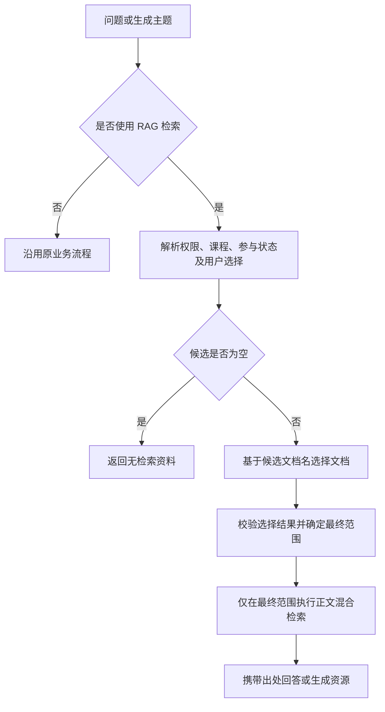

# 轻量 Agent RAG 功能规划

日期：2026-09-07
状态：后端实现完成，定向测试通过；浏览器产品验收待执行，未标记上线。

配套文档：[实施计划](../plans/2026-09-07-lightweight-agent-rag-implementation-cn.md) · [验收文档](../acceptance/2026-09-07-lightweight-agent-rag-acceptance-cn.md)

## 1. 目标与范围

用户启用 RAG 问答，或生成资源时采用 RAG 检索来源，系统先根据问题选择相关文档名，再只在这些文档中检索正文片段，最终用于回答或生成资源。

采用一次模型文档选择加现有混合检索，不引入多 Agent、循环规划、新向量库或重新导入历史文档。文档选择上限与正文片段 top_k 分开配置。

示例：“生成二叉树遍历练习” → 在允许使用的文档名中选出《树与二叉树.pdf》 → 检索该文档中的遍历知识 → 生成练习及来源。

## 2. 现状依据

以下路径相对于项目根目录，依据本次静态代码检查：

| 入口或模块 | 当前行为 | 目标改动 |
| --- | --- | --- |
| `backend/src/modules/rag_v2/rag_main/system.py` 的 `query` | 按用户、课程、参与状态及 selected_doc_ids 确定范围，再检索 | 范围确定后增加文档名选择 |
| 同文件 `retrieve_documents` | 复用关键词、向量及重排，接受 allowed_sources | 保留底层片段检索职责，新增上层共用编排 |
| `backend/src/modules/rag_v2/rag_main/api.py` 的 `rag_query_stream` | 独立构造范围并直接检索 | 接入相同编排，覆盖普通和增强分支 |
| `backend/src/app/chat/tools/agent_tools.py` 的 `rag_search_tool` | 解析课程文档别名，再调用 query | 复用 query；避免重复选文档 |
| `backend/src/app/services/classroom_service.py` 的 `fetch_course_rag_snippets` | 在课程来源中直接 hybrid_search | 接入文档选择和限定片段检索 |
| `backend/src/app/services/generation_task_handlers.py` 的 `search_many` | 在传入文档集合内直接 hybrid_search | 接入相同编排 |
| `backend/src/app/services/generation_source_resolver.py` | course_auto 调用 search_many；selected_documents 调用 read_many；none 不读取 | course_auto 使用两阶段检索；保留其他模式契约 |
| `backend/src/app/api/teacher.py` 的教案、报告、测验接口 | 读取显式选择文档全文 | 属于全文来源生成；本轮保留，不能误称已走两阶段检索 |

`rag_v2` 是当前有效运行时；不得新增旧 RAG 模块依赖。实施时继续检查调用链，补齐仍在使用的 RAG 检索旁路。

## 3. 处理流程

对于多轮问答，沿用现有问题重写完成指代消解，再用有效问题选文档。生成侧使用生成主题和明确要求，不以“报告”“测验”等资源类型单独代替具体主题；主题缺失时跳过模型选择并记录原因。

## 4. 候选范围与标识

候选必须先经过调用方的用户访问、课程归属、文档有效状态和 include_in_search 校验。用户手动选择文档时，该集合是额外上限，自动选择不能扩大范围。课程空库和无效选择都返回空集合，不得转换为不限范围的 None。

文档唯一身份使用 RAG index_key；向量检索使用其对应 source_key，兼容映射集中处理。文件名仅用于相关性判断，重名文件不得合并或凭文件名授权。现有别名解析仍由 document_resolver 与 rag_client 承担。

模型只收到问题、临时候选编号和文件名，不发送正文或物理路径。返回编号映射回服务端候选记录后才能生成过滤条件。文件名作为数据处理，不能执行其中的指令。

## 5. 文档选择与降级规则

建议新增 `backend/src/modules/rag_v2/document_selector.py`，通过可注入模型调用器实现选择。复用项目已有模型配置和调用设施，不新增供应商。

一期默认参数（设计值，尚未实测）：文档选择上限 5；单次最多 100 个文件名、合计最多 12000 字符；选择调用超时 8 秒；最多一次选择调用、不重试。参数集中配置并允许测试覆盖。

候选超过数量或字符预算时，先用规范化文件名与问题的轻量词项匹配排序，按稳定次序取预算内候选。不截断单个名称来伪装完整信息。记录预筛选数量，并在验收中单独检查大候选集合的漏选风险。

模型输出结构为 `{"status":"selected|uncertain|no_match","selected_ids":["d1"]}`。选中文档必须去重、属于本次模型候选，且不能超过上限；非法编号或结构错误视为选择失败。理由无需传到产品界面。

| 情况 | 行为 |
| --- | --- |
| RAG 未启用 | 不调用选择器和片段检索 |
| 无授权候选、显式选择均无效 | 返回空；不调用模型或向量库 |
| 只有一个候选 | 直接选中，不调用选择模型 |
| 正常选择 | 只检索合法选中文档 |
| uncertain、no_match、空选择、格式错误、越界编号、超时、模型不可用 | 回退到本次原始允许范围内的现有片段检索，记录具体原因 |
| 缺少有效生成主题 | 跳过选择，在原始允许范围检索或沿用调用方已有参数校验 |
| 选中文档正文检索为空 | 保持空结果，不自动再扩大范围或启动第二轮选择 |

回退用于避免笼统文件名导致漏检；回退并不表示标题筛选成功。原始范围仍受权限、课程、参与状态和用户选择约束。不得宣称每次请求都必然缩小范围。

## 6. 共用编排与接口

建议在 RAGSystem 增加共用的两阶段检索方法，接收已校验候选、问题、片段 top_k 和已有检索选项，返回 chunks 与 selection_trace。先选择，再调用现有普通或增强检索；底层通用 retrieve_documents 不隐式启用选择，以免影响文档测试、评估等调用。

问答 query、独立流式接口及资源 RAG 检索入口共用这一编排。候选构建可依业务不同而保留适配，但选择规则和最终来源过滤必须共用。服务层通过公开 RAG 接口调用，不自行复制选择 prompt。

selection_trace 至少记录：enabled、candidate_count、shortlisted_count、selected_count、内部 selected_index_keys、effective_source_count、fallback_reason、selection_elapsed_ms、selector_call_count。命名与序列化在实施时固定。默认保存到结构化内部日志；不向浏览器暴露含物理路径的 index_key。来源引用继续使用现有可公开标识和显示名称。

选择阶段不生成最终答案。资源端直接使用片段，避免为了取证据先生成一遍问答答案。现有非流式与流式响应结构、出处及多模态关联继续兼容。

## 7. 产品边界

- 勾选 RAG 的问答（包括显式选择文档的问答）采用两阶段检索。
- 资源来源为 course_auto 或其他明确的 RAG 检索路径时采用两阶段检索。
- selected_documents 当前表示读取选中文档全文，保留其完整来源语义；整篇总结等任务不能被静默缩减为几个片段。
- none、不启用 RAG、文档管理、导入、全文查看和独立检索评估不新增模型选择调用。
- 一期无需增加前端选项或展示模型内部推理。完成验收必须分别证明问答和资源生成路径，不能仅证明后端工具可调用。

## 8. 风险与完成条件

文件名不具体可能漏选；跨文档问题可能超过选择上限；模型选择增加首响应等待。通过范围内降级、跨文档与大集合用例、耗时记录验证，不承诺未经测量的召回提升或速度提升。

完成要求：所有有效 RAG 检索入口接入共用编排；权限与空范围测试通过；真实问答和资源生成各有完整证据；正常选择案例证明过滤条件在片段检索前生效；验收文档填入实际结果。当前仅完成文档，不满足功能完成条件。

## 9. 实施补充（2026-09-07）

共用方法落在 `RAGSystem.retrieve_two_stage`；选择器可接收注入的模型调用函数，并兼容 JSON 代码围栏。生成查询合并主题与要求；无有效主题由现有 source resolver 拒绝 course_auto 请求。模型调用超时沿用 requests 的网络超时语义，并非严格的端到端墙钟上限。

已接入 query、rag_query_stream、fetch_course_rag_snippets、search_many。后者服务当前 report、blog、quiz、flashcard、graph、game、lesson_plan 的通用生成路径；不代表这些资源均完成浏览器实测。全文模式继续 read_many。

额外修复：流式来源不再对已有 index_key 重复添加用户前缀；关闭 RAG 的 query 初始化 retrieval_metrics，避免未赋值异常。真实模型最终三个选择案例通过，另保留首次执行中一次降级记录。完整结果见验收文档。
